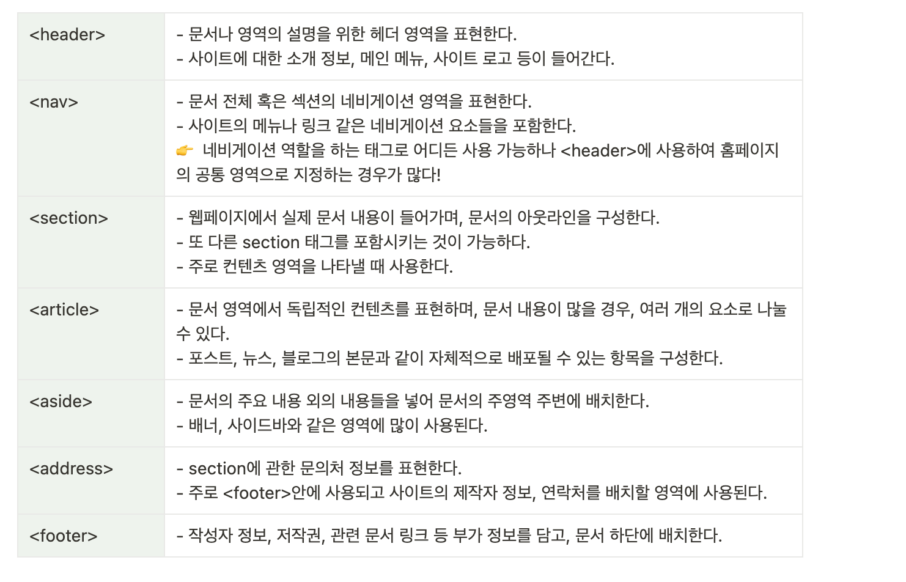

# HTML5의 가장 큰 특징

💡 **HTML5의 정의**

- W3C에서 만들고 있는 차세대 웹 표준으로 특정 기업의 독점 기술에 의존하지 않고 표준화된 웹 환경을 만들기 위해 기술
- add-on 또는 plug-in 없이도 웹 사용이 가능하도록 광범위 하면서도 자세하게 규약 제정
- 문서구조(DOM), 마크업(Markup)표준, API 표준으로 구성되고, 추가적인 플러그인 없이 Rich Web응용을 가능하게 함

 

> **HTML5 시맨틱 마크업**

- 시맨틱(Semantic)은 “의미론적인" 이란 뜻을 가진 단어로 HTML 문서에 의미를 부여 하겠다는 의도가 담겨져 있다.
  👉 개발자와 브라우저에게 의미있는 태그를 제공한다.

- 기존 HTML4 보다 명확한 의미표현이 가능하도록 26개 정도의 새로운 마크업 추가로 검색엔진 등 웹 콘텐츠 기반의 다양한 서비스나 응용의 개선된 기능을 제공한다.
  

👉 위와 같이 다양한 목적으로 사용되던 사용자 정의 형식의 태그들이 모두 표준화로 사용 될 수 있다!

👉 이렇게 의미를 가진 태그는 검색엔진이나 그 외에 기계적인 동작들이 웹페이지를 쉽게 이해 할 수 있게 된다.

- 자주 사용되는 시맨틱 태그의 종류
  

- 시맨틱 태그를 사용해야 하는 이유
  - **검색 엔진 최적화**(SEO : Search Engine Optimization)
    - 검색엔진이 웹페이지의 자료를 수집하거나 순위를 방식에 맞게 웹페이지를 구성하여, 검색 결과에 상위에 나올 수 있게하는 행위를 말한다.
  - **접근성이 좋아지며 코드의 가독성이 좋아진다.**
  - **코드와 테이터의 재사용성이 높아진다.**
  - **의미부여**
    - 무의미한 요소(Non-Semantic Element)로 문서를 작성할 경우, HTML 문서를 접하는 사람의 경우 어떤 데이터를 봐야할지, 어떤 것을 제공하는지 파악하기가 어렵다.
    - 시맨틱 마크업을 사용하여 문서에 의미를 부여해주고 의미를 올바르게 부여해주는 행위만으로 자신 뿐만 아니라 동료들에게 더 실용적으로 시간을 줄여 줄 수 있다.

> **웹 문서 뿐만 아니라 웹 어플리케이션도 만들 수 있는 플랫폼**

- HTML5는 웹 어플리케이션을 쉽게 구현하고 싶어하는 웹 브라우저 제조업체들로 부터 시작했기 때문에 단순한 마크업 언어가 아니다.
- HTML5는 단순히 이미지나 텍스트를 표시하던 수준을 벗어나 웹 어플리케이션을 만들 수 있는 API까지 포함 하고 있다.

> **플러그인 없이 멀티미디어를 재생 할 수 있는 요소 추가**

- 웹상에서 동영상, 오디오를 표현하기 위해 다른 외부 Active-X와 같은 plug-in을 사용하지 않고도 웹서비스를 제공할 수 있도록, 멀티미디어 태그 및 API를 지원하는 기능이 추가 되었다.
- 기존의 웹 문서에서 HTML 만으로 다양한 웹서비스를 구성하는 것이 불가능 하였지만, HTML5로 넘어오면서 클라이언트와 서버와의 통신이 가능해지고, Active-X와 같은 플러그인의 설치 없이도 자체적으로 음악이나 동영상의 재생이 가능해졌다.

👉 Active-X : 웹브라우저와 연동되는 플러그인 이라는 특정 프로그램을 사용자의 PC에 추가로 설치하여 웹브라우저의 기능을 확장 시킴으로써, 웹서비스를 제공하고 사용자가 이용 할 수 있게 되는데, MS의 인터넷 익스플러용 플러그인인 “Active-X” 가 가장 대표적인 플러그인의 하나이다.

👉 Active-X는 마이크로소프트의 인터넷 익스플로어 에서만 사용 할 수 있기 때문에 호환성 면에서 큰 문제점을 드러내며 윈도우 기반의 PC가 아닌 스마트폰이나 태블릿PC 에서도 전혀 사용할 수 없으므로 사용자 접근성 에서도 치명적인 한계에 부딪힌다.

- HTML5의 등장으로 CSS3, JavaScript API를 통한 기능의 확장과 결합을 통해, HTML5로 개발된 웹사이트는 외부 플러그인의 설치 없이도 동영상이나 음악의 재생이 가능하게 되고, 어떠한 웹브라우저나 운영체제를 사용하더라도 동일한 웹페이지를 표시해주는 웹표준과 웹접근성을 획기적으로 높여주게 되었다.

| audio | - 별도의 플러그인 없이 오디오를 재생하며, 스크립트를 통해 오디오를 제어 할 수 있다. |
| ----- | ----------------------------------------------------------------------------------- |
| video | - 윈도우 미디어와 같은 별도의 플러그인 없이 동영상을 재생 할 수 있다.               |

👍🏻 참조

- [HTML의 기술적 특징](https://blog.naver.com/PostView.nhn?blogId=msgbox486&logNo=221946392412&categoryNo=0&parentCategoryNo=0&viewDate=&currentPage=1&postListTopCurrentPage=1&from=postView)
- [HTML의 개념, 구성, 주요기능, 전망](https://jhkim3624.tistory.com/176)
