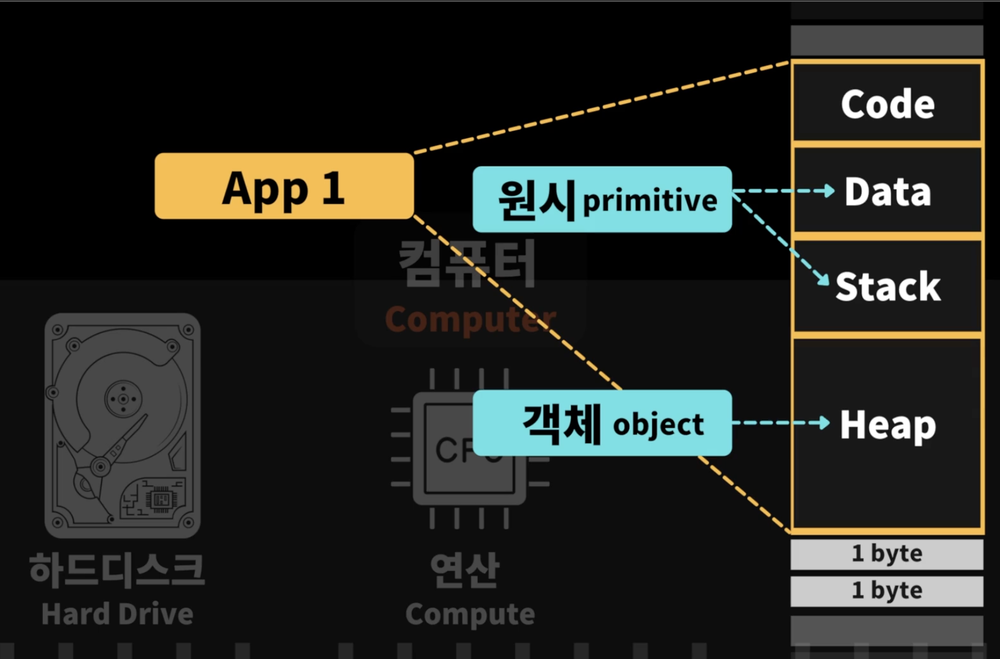
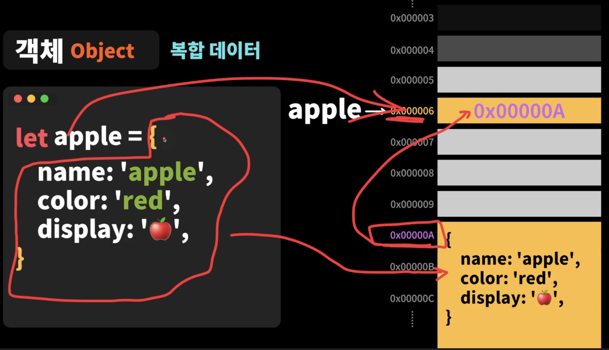
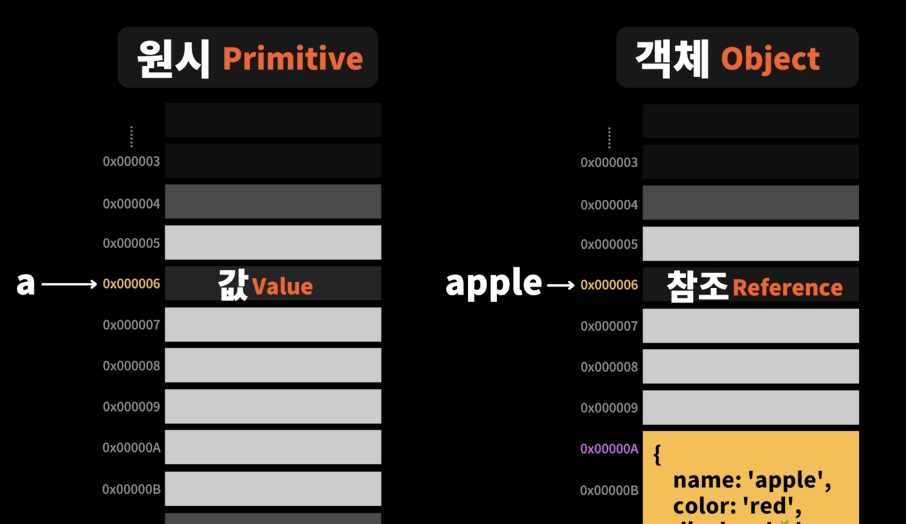

# 데이터타입

## > 데이터 타입의 종류

### 단일 데이터 (원시타입 primitive)

- 숫자(number)타입 - 숫자, 정수와 실수 구분 없이 하나의 숫자 타입만 존재

  ```jsx
  let integer = 123; // 정수
  let negative = -123; // 음수
  let double = 1.23; // 실수

  let binary = 0b1111011; // 2진수
  let octal = 0o173; // 8진수
  let hax = 0x7b; // 16진수

  console.log(0 / 123); // 0
  console.log(123 / 0); // Infinity
  console.log(123 / -0); // -Infinity
  console.log(123 / "text"); // NaN
  ```

- 문자열(string)타입 - 문자열

  ```jsx
  let string = "hello";
  string = `hi`;

  // 템플릿 리터럴 (Template Literal) ``
  let id = "Hyun";
  let greetings = `'hi, ${id} hello'`;
  console.log(greetings); // hi, Hyun hello
  ```

- 불리언(boolean)타입 - 논리적 참(true)과 거짓(false)

  ```jsx
  let isFree = true;
  let isActivated = false;

  // Falshy 거짓인 값
  console.log(!!0);
  console.log(!!-0);
  console.log(!!"");
  console.log(!!null);
  console.log(!!undefined);
  console.log(!!NaN);

  // Truthy 참인 값
  console.log(!!1);
  console.log(!!-1);
  console.log(!!"text");
  console.log(!!{});
  console.log(!!Infinity);
  ```

- undefined타입 - var 키워드로 선언된 변수에 암묵적으로 할당되는 값

  ```jsx
  let variable;
  console.log(variable);

  console.log(typeof undefined); // undefined
  ```

- null 타입 - 값이 없다는 것을 의도적으로 명시할 때 사용하는 값

  ```jsx
  variable = null;
  console.log(variable);

  console.log(typeof null); // object
  ```

- 심벌(symbol) 타입 - ES6에서 추가된 7번째 타입

  - 변경 불가능한 원시 타입의 값이다. 심벌 값은 다른 값과 중복되지 않는 유일무이한 값이다. 따라서 주로 이름이 충돌할 위험이 없는 객체의 유일한 프로퍼티 키를 만들기 위해 사용한다.

  ```jsx
  // 위, 아래, 왼쪽, 오른쪽을 나타내는 상수를 정의한다.
  // 중복될 가능성이 없는 심벌 값으로 상수 값을 생성한다.
  const Direction = {
    UP: Symbol("up"),
    DOWN: Symbol("down"),
    LEFT: Symbol("left"),
    RIGHT: Symbol("right"),
  };

  const myDirection = Direction.UP;

  if (myDirection === Direction.UP) {
    console.log("going UP");
  }
  ```

### 복합 데이터 (객체타입 object)

- 여러가지의 데이터를 함께 묶어 놓은 것 👉 { Key: value }

애플리케이션을 실행할 때 Code / Data / Stack / Heap 으로 나뉘어져 있는데, 여기서

- **원시타입**의 경우 : 어디에 변수가 선언돼 있는지에 따라서 Data(글로벌)나 Stack(로컬)에 들어가 있다.



- **객체타입**의 경우 : key 와 value 형태로 여러개가 묶일 수 있기 때문에 사이즈가 정해져 있지 않다 → 즉, 메모리셀 안에 한번에 다 들어갈 수 없기 때문에 **Heap** 이라는 메모리 공간에 할당된다.

**Heap**안에는 데이터의 사이즈가 정해져 있지 않고 동적으로 사이즈가 변경되는 것들이 보관되어 지는 장소다.



- 객체 {} 자체는 Heap 어딘가 메모리에 저장 돼 있다. (메모리셀 하나 안에 커다란 객체가 들어갈 수 없기 때문에 셀 여러개에 걸쳐서 할당이 된다.)
- apple이라는 변수 이름은 `0x000006` 이라는 메모리 셀을 가리킨다.
- 메모리 셀(0x000006) 안에는 실제 오브젝트가 들어있는 메모리 주소(0x00000A)를 가리킨다.

👉 객체는 뚱뚱하여 하나의 메모리 안에 다 들어갈 수 없기 때문에 Heap 이라는 조금 더 떨어진 메모리 공간에 할당이 되고 apple이라는 변수는 그 객체가 할당된 곳의 주소를 가리키고 있다.

### 값과 참조의 차이 ⭐



- 원시타입은 값 자체가 메모리 셀에 들어가 있다.
- 객체는 참조(Reference)값 즉, 메모리주소가 변수에 들어있다.
  → 메모리주소가 복사되어서 전달된다.

```jsx
// 원시타입은 값이 복사되어 전달된다.
let a = 1;
let b = a; // 1
b = 2;
console.log(a); // 1
console.log(b); // 2

// 객체타입은 참조값(메모리주소, 레퍼런스)가 복사되어 전달된다.
let apple = {
  name: "사과", // 0x1234 메모리주소
};
let orange = apple; // 0x1234
orange.name = "오렌지";
console.log(apple); // { name: '오렌지' }
console.log(orange); //  { name: '오렌지' } -> 동일한 오브젝트를 가리키도 있다.
```

### 데이터 타입이 필요한 이유

1. 값을 저장할 때 확보해야 하는 메모리 공간의 크기를 결정하기 위해서
2. 값을 참조할 때 한 번에 읽어 들여야 할 메모리 공간의 크기를 결정하기 위해서
3. 메모리에서 읽어 들인 2진수를 어떻게 해석할지 결정하기 위해서

## > 정적 타이핑 / 동적 타이핑

- **정적 타이핑**
  <br/>
  C나 자바 같은 정적 타입언어는 변수를 선언할 때 변수에 할당할 수 있는 값의 종류, 즉 데이터 타입을 사전에 선언해야 한다. 이를 명시적 타입 선언이라 한다. 다음은 C에서 정수 타입의 변수를 선언하는 예이다.

  ```jsx
  // c 변수에는 1바이트 정수 타입의 값(-128 ~ 127)만을 할당할 수 있다.
  char c;

  // num 변수에는 4바이트 정수 타입의 값(-2,124,483,648 ~ 2,124,483,647)만을 할당할 수 있다.
  int num;
  ```

  - 정적 타입 언어는 변수의 타입을 변경할 수 없으며, 변수에 선언한 타입에 맞는 값만 할당할 수 있다.
  - 정적 타입 언어는 컴파일 시점에서 타입 체크를 수행한다. 만약 타입 체크를 통과하지 못했다면 에러를 발생시키고 프로그램의 실행 자체를 막는다. 대표적인 정적 타입 언어로 C, C++, 자바, 코틀린, 고, 러스트 등이 있다.

- **동적 타이핑**
  <br/>
  자바스크립트는 정적 타입 언어와 다르게 변수를 선언할 때 타입을 선언하지 않는다. 다만 var, let, const 키워들 사용해 변수를 선언할 뿐이다.

  ```jsx
  var foo;
  console.log(typeof foo); // undefined

  foo = 3;
  console.log(typeof foo); // number

  foo = null;
  console.log(typeof foo); // object

  foo = Symbol(); // 심벌
  console.log(typeof foo); // symbol

  foo = {}; // 객체
  console.log(typeof foo); // object

  foo = []; // 배열
  console.log(typeof foo); // object

  foo = function () {}; // 함수
  console.log(typeof foo); // function
  ```

  자바스크립트의 변수는 선언이 아닌 할당에 의해 타입이 결정 **(타입 추론)**
  된다. 그리고 재할당에 의해 변수의 타입은 언제든지 동적으로 변할 수 있다.
  이러한 특징을 동적 타이핑이라고 하며, 자바스크립트를 정적 타입 언어와 구별하기 위해 동적 타입 언어라고 한다. 대표적인 동적 타입 언어로는 자바스크립트, 파이썬, PHP 등이 있다.
  <br />
  <br />
  **🤔 그렇다면 변수는 타입을 가질까?**
  <br />
  NO! → 기본적으로 변수는 타입을 갖지 않는다. 하지만 값은 타입을 갖는다. 따라서 현재 **변수에 할당 되어 있는 “값”에 변수의 타입이 동적으로 결정**된다고 표현하는 것이 더 적절하다.
  <br>
  <br>
  🤔 **동적 타입 언어의 문제점**

  변수 값은 언제든지 변경될 수 있기 때문에 복잡한 프로그램에서는 변화하는 변수 값을 추적하기 어려울 수 있다. 또한 변수의 타입이 동적으로 변하는 동적 타입 언어의 변수는 값의 변경에 의해 타입도 언제든지 변경될 수 있다.

  - 변수는 꼭 필요한 경우에 한해 제한적으로 사용.
  - 변수의 유효 범위(스코프)는 최대한 좁게 만들어 변수의 부작용 억제.
  - 전역 변수는 최대한 사용하지 않도록.
  - 변수보다는 상수를 사용해 값의 변경 억제.
  - 변수 이름은 변수의 목적이나 의미를 파악할 수 있도록 네이밍
    👉 타입스크립트의 등장 배경이기도 함.
