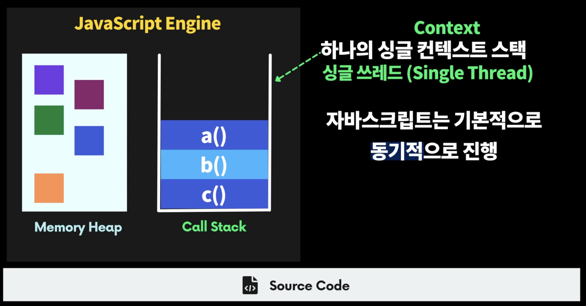
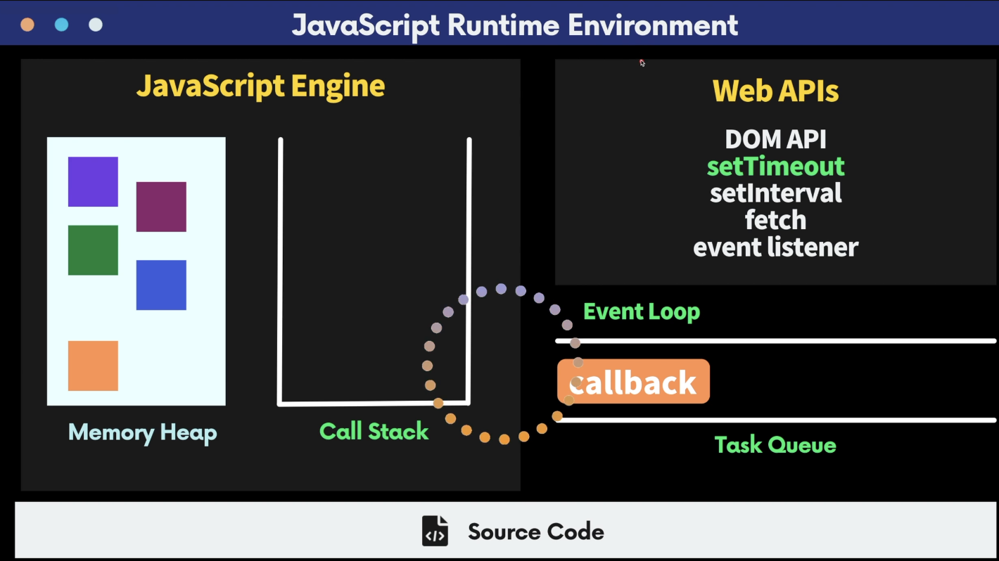
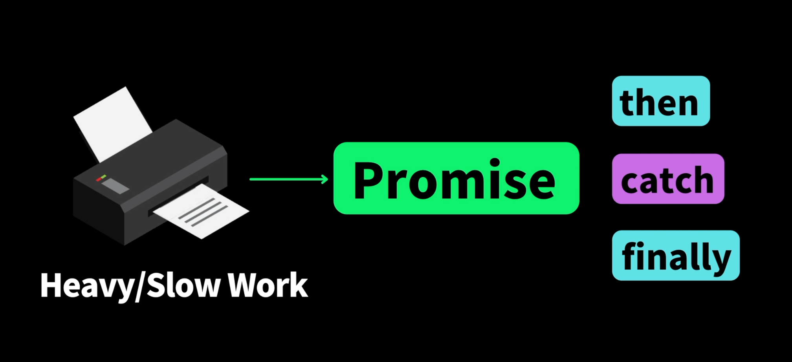

# 비동기 (Async)

## > 자바스크립트 실행 순서 (콜스택)

소스코드에서 동적으로 객체를 생성하는 경우에 **Memory Heap에** 생성이 된다.

Call Stack은 함수의 실행 순서를 기억한다. → 전역에서 c()함수를 실행하면 c()함수가 콜스택에 들어오고 c에서 b()함수를 실행하면 b()도 콜스택에 쌓이고 그 다음에 a()함수를 호출하면 a()함수가 콜스택에 쌓인다.

a() 함수가 끝나고 반환이 되면 콜스택에서 a가 먼저 나가고 그 다음 b가 끝나면 c로 반환이 되고 c가 끝나면 콜스택이 비어있게 된다.

자바스크립트 엔진은 단 하나의 **싱글 컨텍스트** **스택**을 가지고 있다.

→ 한번에 하나의 일만 처리할 수 있는 **싱글 쓰레드 언어**이다.

자바스크립트는 기본적으로 한번에 하나의 일만 수행할 수 있기 때문에 **동기적**으로 진행 된다고 볼 수 있다.



### > 콜백 비동기

🤔 Web APIs (DOM API, setTimeout, setInternal, fetch, event Listener 등)을 사용해 비동기적(병렬적) 으로 실행 할 수 있다. → 멀티쓰레드 환경에서 동작

비동기적으로 자바스크립트 런타임 환경(호스트 환경) 에서 제공해주는 다양한 API들을 사용할 수 있다.


이러한 API들을 호출할 때 우리가 원하는 callback 함수를 던져만 놓으면 내부적으로 비동기적인 일을 수행하고 나서 그 일이 다 끝나고 나면 우리가 등록해 놓은 콜백 함수를 Task Queue에 넣게 되고 자바스크립트 엔진의 Event Loop (중간에 원)가 Call Stack과 Task Queue를 감시하면서 Call Stack이 비어 있을 때만 즉, 어플리케이션이 한가할 때만 Task Queue에 있는 callback 함수를 Call Stack으로 가져오게 된다.

👉 자바스크립트 엔진에서는 Call Stack에 들어온 코드(함수)들만 수행할 수 있다.

👉 Web API들을 여러개 호출하고 비동기적인 일이 끝나면 우리가 등록해놓은 callback 함수들이 순차적으로 Task Queue에 쌓이게 되고 Event Loop가 시기적절하게 빙글빙글 돌면서 Call Stack이 비어있을 때 하나씩 가져온다.

```jsx
function execute() {
  console.log("1");
  setTimeout(() => {
    console.log("2");
  }, 3000);
  console.log("3");
}
execute(); // 1,3,2
```

- execute함수를 호출하면 바로 console.log(”1”)이 먼저 출력이 된다.
- setTimeout 이라는 노드 API를 이용해서 콜백함수를 3초 뒤에 나에게 알려주라고 던져만 놓고 넘어간다.
- 바로 console.log(”3”)을 출력
- 콜백함수는 노드에서 3초 타이머가 진행되면서 3초가 끝나면 콜백함수가 테스크 큐에 들어오고 콜스택이 비어있으니 스택에 가지고와서 다시 하나씩 실행하니
  이 때 바로 console.log(”2”)가 출력된다.

💡 **타임아웃 구현해 보기**

```jsx
// 주어진 seconds(초)가 지나면 callback함수를 호출함
// 단, seconds가 0보다 작으면 에러를 던지자!
function runInDelay(callback, seconds) {
  if (!callback) {
    throw new Error("callback함수를 전달 해야 함");
  }
  if (!seconds || seconds < 0) {
    throw new Error("seconds는 0보다 커야 함");
  }
  setTimeout(callback, seconds * 1000);
}
try {
  runInDelay(() => {
    console.log("타이머 완료!");
  }, 2);
} catch (error) {}
```

## > 프로미스

프로미스는 무겁고 오래 걸리는 일이 있다면 코드 내부에서 조금 더 비동기적으로 처리할 수 있도록 도와준다. (약속)



> **The Promis** -Mdn-
> object represents the eventual completion (or failure) of an asynchronous operation and its resulting value.

→ 비동기적으로 무언가를 수행하고 내가 끝났다고 알려준다.

```jsx
function runInDelay(seconds) {
  return new Promise();
}

runInDelay(2)
.then(필요한일을 수행) // runInDelay가 성공적으로 완료되면 then이 호출!
.catch(에러를 처리) // 실패한다면 catch가 호출!
.finally(최종적으로 무조건 호출) // 성공하든 실패하든 무조건적으로 호출!
```

👇

```jsx
// 주어진 seconds(초)가 지나면 callback함수를 호출함
// 단, seconds가 0보다 작으면 에러를 던지자!

function runInDelay(seconds) {
  return new Promise((resolve, reject) => {
    if (!seconds || seconds < 0) {
      reject(new Error("seconds가 0보다 작음"));
    }
    setTimeout(resolve, seconds * 1000);
  });
}

runInDelay(2)
  .then(() => console.log("타이머 완료!"))
  .catch(console.error)
  .finally(() => console.log("끝났다!"));
```

- Promise 콜백함수 안에서 비동기적인 일을 수행
- .then(성공)을 호출할 때 사용할 resolve라는 함수와 **실패한 것**을 알려줄 reject를 받아와야 한다.
- timeout이 끝나면 resolve를 호출 / seconds가 없거나 0 보다 작으면 reject를 호출한다.

💡 성공하는 케이스만 처리할것 이라면 catch 와 finally는 생략이 가능하다. → 프로미스에서 에러가 발생하는데 catch가 없다면 warning 경고! → 가급적이면 .then 과 .catch를 이용해서 에러를 잡아주자

### 😃 프로미스 함수들

```jsx
function fetchEgg(chicken) {
  return Promise.resolve(`${chicken} => 🥚`);
}

function fryEgg(egg) {
  return Promise.resolve(`${egg} => 🍳`);
}

function getChicken() {
  return Promise.reject(new Error("치킨을 가지고 올 수 없음!"));
  //return Promise.resolve(`🪴 => 🐓`);
}

getChicken()
  .catch(() => "🐔") // 치킨을 가지고 오는데 실패하면 "🐔"
  .then(fetchEgg) // 그리고 "🐔"를 이용해서 "🥚"을 가지고오고
  .then(fryEgg) // "🥚"을 fry 한다음에
  .then(console.log); // 콘솔에 출력!!

// 🐔 => 🥚 => 🍳
```

- Promise 여러개를 체이닝 할 수 있다.
- catch를 어디에 두느냐에 따라서 더 의미있는 코딩을 할 수 있다.

**💡 프로미스 병렬 처리 (다양한 static 함수들)**

```jsx
function getBanana() {
  return new Promise((resolve) => {
    setTimeout(() => {
      resolve("🍌");
    }, 1000);
  });
}

function getApple() {
  return new Promise((resolve) => {
    setTimeout(() => {
      resolve("🍎");
    }, 3000);
  });
}

function getOrange() {
  return Promise.reject(new Error("no orange"));
}

// 바나나과 사과를 같이 가지고 오기
getBanana() //
  .then((banana) =>
    getApple() //
      .then((apple) => [banana, apple])
  )
  .then(console.log); // [ '🍌', '🍎' ]
// 순차적으로 Promise를 진행하니까 바나나를 가져오는데 1초 사과를 가져오는데 3초가 걸려 총 4초가 걸린다
// -> 시간이 오래 걸릴 수 있기 때문에 병렬적으로 실행할 수있는 방법이 있다!

// Promise.all 병렬적으로 한번에 모든 Promise들을 실행!
Promise.all([getBanana(), getApple()]) //
  .then((fruits) => console.log("all", fruits));

// Promise.race 주어진 Promise중에 제일 빨리 수행된것이 이김!
Promise.race([getBanana(), getApple()]) //
  .then((fruit) => console.log("race", fruit));

Promise.all([getBanana(), getApple(), getOrange()]) //
  .then((fruits) => console.log("all-error", fruits))
  .catch(console.log);

Promise.allSettled([getBanana(), getApple(), getOrange()]) //
  .then((fruits) => console.log("all-settle", fruits))
  .catch(console.log);
```

## > async, await

비동기적인 코드를 동기적인 형태로 즉, 절차적으로 사용할 수 있는 방법!

동기적인 코드 처럼 보이지만 비동기적인 코드를 작성할 수 있는 **async**

```jsx
function getBanana() {
  return new Promise((resolve) => {
    setTimeout(() => {
      resolve("🍌");
    }, 1000);
  });
}

function getApple() {
  return new Promise((resolve) => {
    setTimeout(() => {
      resolve("🍎");
    }, 3000);
  });
}

function getOrange() {
  return Promise.reject(new Error("no orange"));
}

// 바나나와 사과를 함께 가지고 와서 배열에 간직하고 싶다.
async function fetchFruits() {
  const banana = await getBanana(); // 바나나를 받아올 때까지 기다렸다가(await) 바나나 변수에 할당!
  const apple = await getApple(); // apple에는 promise가 들어있기 때문에 await! 하고 변수에 할당
  return [banana, apple]; // 그 다음에 return
}

fetchFruits() //
  .then((fruits) => console.log(fruits)); // [ '🍌', '🍎' ]
```

- Promise를 쓸때 함수 안에서 getBanana()와 getApple()은 Promise를 return 하는데 .then, .then으로 엮는 것이 아니라 **async라는 키워드만** 사용하면 **이 안에서 비동기적인 코드를 동기적(절차적)으로** 사용할 수 있다.
- 단, Promise를 return하는 함수를 호출할 때는 **await이라는 키워드**를 써서 기다렸다가 Promise값이 resolve가 되면 그 값을 반환하여 변수에 할당하고 [banna, apple]을 return 할지라도 async 키워드가 붙여졌기 때문에 fetchFruits함수의 값은 [banana, apple]을 resolve 하는 Promise가 만들어진다.

👉 fetchFruits이라는 함수를 호출하면 결국 Promise가 return이 되고 이 Promise 안에서 await들이 비동기적으로 처리가 되다가 다 기다려지면 return [banana, apple] 값을 resolve 하는 Promise가 되는 것!!

**💡 예제**

```jsx
function fetchEgg(chicken) {
  return Promise.resolve(`${chicken} => 🥚`);
}

function fryEgg(egg) {
  return Promise.resolve(`${egg} => 🍳`);
}

function getChicken() {
  return Promise.reject(new Error("치킨을 가지고 올 수 없음!"));
  //return Promise.resolve(`🪴 => 🐓`);
}

function makeFriedEgg() {
  return getChicken()
    .catch(() => "🐔")
    .then(fetchEgg)
    .then(fryEgg);
}

makeFriedEgg().then(console.log); // 🐔 => 🥚 => 🍳

// async, await 키워드를 사용하여 비동기함수로 변환

async function makeFriedEgg() {
  let chicken;
  try {
    chicken = await getChicken();
  } catch {
    chicken = "🐔";
  }
  const egg = await fetchEgg(chicken);
  return fryEgg(egg);
}

makeFriedEgg().then(console.log); // 🐔 => 🥚 => 🍳
```

## > JSON 이란?

> _JSON: JavaScript Object Notation_

→ 자바스크립트에서 사용하는 객체(Object)를 조금 더 서버와 주고받기 편한 문자열 형태로 변환

**_서버와 클라이언트(브라우저, 모바일) 간의 HTTP 통신을 위한 오브젝트 형태의 텍스트 포맷_**

- **stringify(object)**: JSON : object를 JSON으로 변환해주는 stringify
- **parse(JSON)**: object : 서버로 부터 JSON을 받는다면 parse를 이용해 JSON 문자열을 object로 변환

```jsx
const Hyun = {
  name: "Hyun",
  age: 20,
  eat: () => {
    console.log("eat");
  },
};

// 직렬화 Serializing: 객체를 문자열로 변환
const json = JSON.stringify(Hyun);
console.log(Hyun); // { name: 'Hyun', age: 20, eat: [Function: eat] }
console.log(json); // {"name":"Hyun","age":20}

// 역직렬화 Deserializing: 문자열 데이터를 자바스크립트 객체로 변환
const obj = JSON.parse(json);
console.log(obj); // { name: 'Hyun', age: 20 }
```
