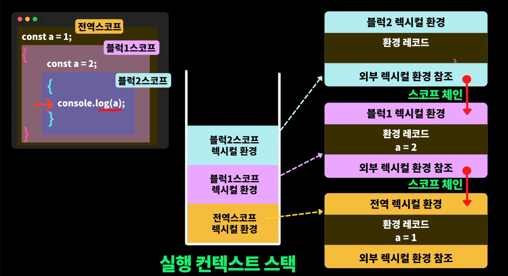

# 스코프

## > 스코프란?

> 스코프 Scope : 범위, 영역

**프로그래밍에서 스코프란?**

- 변수를 참조할 수 있는(접근할 수 있는) 유효한 범위
- 식별자(변수, 함수, 클래스 이름)가 유효한 범위

👉 선언된 위치에 따라서 유효 범위가 결정된다.

그럼 범위는 어떻게 결정할까 ?

```jsx
{
  블럭 안의 변수는 블럭 안에서만 유효
}
```

- 왜 이런 스코프가 존재하는지? : 식별자들 이름 충돌 방지, 메모리 절약

👉 **변수, 식별자는 최대한 필요한 곳에서 정의 !!**

코드 블럭: _{ }, if() { }, for() { }, function() { }_

```jsx
{
  const a = "a";
}
console.log(a); // app crached
const b = "b";
```

- _블럭 외부에서는 블럭 내부의 변수를 참조할 수 없다._

```jsx
function print() {
  const message = "Hello World";
  console.log(message);
}
console.log(message);
```

- _함수 외부에서는 함수 내부의 변수를 참조할 수 없다._

```jsx
function sum(a, b) {
  console.log(a, b);
}
console.log(a, b);
```

- _함수 외부에서는 함수의 매개변수를 참조할 수 없다._

## > 스코프 예제

```jsx
{
  const x = 1;
  {
    const y = 2;
    console.log(x); // 1
  }
  console.log(x); // 1
  console.log(y); // y는 블럭 안에 있기 때문에 외부에서 참조할 수 없음
}
```

```jsx
const text = "global"; // 전역 변수, 전역 스코프 (글로벌 변수, 글로벌 스코프)
{
  const text = "inside block1"; // 지역 변수(로컬변수), 지역 스코프(로컬스코프) -> 블럭 내부
  {
    const text = "inside block2";
    console.log(text); // 'inside block2'
  }
}
```

## > 가비지 컬렉터 (Garbage Collector)

메모리를 청소하지 않아도 조금 더 편안하게 프로그래밍 할 수 있다.

자바스크립트에서 **Garbage collection** (쓰레기 수집)이 발생하는 원리는
자바스크립트 엔진에서 자체적으로 제공해주는 **Garbage Collector**가 백그라운드 에서 동작을 하는데

어플리케이션에서 사용하는 메모리를 감시하고 확인하면서 아무도 **참조하고 있지 않은 메모리**를 **청소**해준다.

→ 불필요한 메모리를 너무 많이 할당하지 말고 필요한 만큼 해주는 것이 좋다.

- **글로벌 변수**는 앱이 종료될때까지 계속 메모리에 유지된다.
  → 가급적 변수는 **필요한 곳**에서 쓰자

```jsx
const global = 1;
{
  // 블럭 내부에서만 존재하고, 블럭이 끝나면 자동으로 소멸된다. (GC)
  const local = 1;
}
```

```jsx
function print() {
  // 함수 내부에서도 블럭안에서 필요한 경우에는
  // 필요한 곳에서 블럭 안에서 변수를 선언하고 사용해야 한다!
  if (true) {
    let temp = 0;
  }
```

## > 실행 컨텍스트 (Execution Context)

**코드의 실행 순서와 스코프를 기억한다!!**

```jsx
const a = 1; // 전역 스코프
{
  const a = 2; // 블럭 스코프1
  {
    const a = 3; // 블럭 스코프2
  }
}
```

- **각각의 블록**은 **렉시컬 환경**(Lexical Environtment)라는 **내부 오브젝트**를 가지고 있다!
- 렉시컬 환경 안에는
  - **환경 레코드**(현재 블럭에 해당하는 정보를 담고있는)
  - **외부 환경 참조**(부모는 누군지 부모를 참조하고 있는)



- 블럭2 렉시컬 환경에선 a라는 변수가 없는 것을 확인
- 바로 상위에 있는(스코프 체인) 부모가 누군지 확인
- 부모 환경 레코드 안에 a = 2 라는 변수가 있는지 없는지 검사
- 부모에 a가 있으니깐 2를 출력!

### 👉 **이러한 렉시컬 환경, 스코프 체인을 통해서 어떤 것을 배울 수 있을까 ??**

**메모리 절약** 뿐만 아니라, **성능**을 위해서라도 **변수는 최대한 필요한 곳에서 정의**!!!

→ 중첩된 스코프나 여러가지 중첩된 함수가 있다면 스코프 체인을 하면서 계속 검사를 하니 성능에도 좋지가 않다.

**😃 정리**

스코프 밖에서는 스코프 내부에 있는 것에 대해서 접근할 수 없지만, 스코프 내부에선 외부로 접근할 수 있다.

→ 이것이 가능한 이유는 각각의 **스코프**는 **렉시컬 환경** 안에 **외부 렉시컬 환경 참조**로 **스코프 체인**을 통해 부모의 데이터에 접근할 수 있기 때문 !! (당연히 함수도 마찬가지)

## > 호이스팅

**자바스크립트 문법에서 변수나 함수를 선언 이전에 사용할 수 있다.**

💡 정말 위로 끌어 올려지는 것이 아닌 변수나 함수를 선언 이전에 사용할 수 있기 때문에 **끌어 올려지는 것처럼 보이는 것일 뿐!!**

**그렇다면 어떻게 선언 이전에 사용할 수 있을까 ?**

👉 실행컨텍스트가 생성될 때 변수 객체에 배열 식별자 정보를 담는 variable 배열에 변수들을 먼저 담는다.

👉 먼저 담기 때문에 선언을 나중에 해도 사용이 가능한 것!!

**그렇다면 var와 달리 const, let은 어떻게 호이스팅 되지 않고 TDZ에 들어가는 것일까 ?**

👉 var는 선언과 동시에 AllocateTo 메소드를 통해 메모리에 바로 할당이 된다.

👉 하지만 const나 let 키워드는 set_initializer_position 메소드를 통해 해당 코드의 position을 정해주어
초기화 해주는 과정을 거친다.

🤔 즉, var와 달리 메모리 할당 이전에 일종의 방어코드가 추가됨으로써, 선언은 되어 있지만 변수에 값을 담기 위한 메모리에 공간이 확보되지 않은 상태가 되는 것이다!

🤔 즉, const나 let 또한 동일하게 실행컨텍스트가 생성되는 시점에 variable 배열에 담겨 호이스팅이 되지만
일종의 초기화(set_initializer_position)로 인해 선언이나 할당 이전에 미리 사용할 수 없게 된것!

```jsx
// 함수의 호이스팅은 함수의 선언문 전에 호출이 가능하게 해줌
// 함수의 선언문은 선언 이전에도 호출이 가능함
print(); // Hello

function print() {
  console.log("Hello");
}
```

```jsx
console.log(hi); // Cannnot access 'hi' before initialization
let hi = "hi";
```

- initialization(초기화) 하기 전에는 접근할 수 없다.
- hi가 선언은 되었지만 아직 초기화가 되지 않았다.

_변수(let, const)와 클래스는 선언만 호이스팅이 되고, 초기화는 안된다._

_초기화 전, 변수에 접근하면 컴파일(빌드) 에러가 발생_

👉 함수 선언은 완벽하게 호이스팅이 되지만 변수,클래스는 선언전에 접근할 수 없다.

```jsx
let x = 1;
{
  console.log(x); // 1
}
```

```jsx
let x = 1;
{
  console.log(x); // Cannnot access 'x' before initialization
  let x = 2;
}
```

- 블럭안에서 변수를 선언했기 때문에 선언된 부분(let x)만 호이스팅이 돼서 위로 올라오고
  x라는 변수는 블럭 내부에 존재하는데 아직 초기화가 되지 않아서 에러가 나옴

### var 변수의 특징

코드의 가독성과 유지보수성에 좋지 않음

```jsx
// 1. 변수 선언하는 키워드 없이 선언 & 할당이 가능함
// 선언인지, 재할당인지 구분하기 어렵다!!
something = "💩";
console.log(something);

// 2. 중복 선언이 가능함 -> 여러명이서 협업하는 경우에 실수 발생할 수 있다.
var poo = "💩";
var poo = "💩";
console.log(poo);

// 3. 블록 레벨 스코프 안됨
var apple = "사과";
{
  var apple = "🍎";
  {
    var apple = "🍏";
  }
}
console.log(apple); // 🍏

// 4. 함수 레벨 스코프만 지원 됨
function example() {
  var dog = "🦮";
}
console.log(dog);
```

- var 키워드 써서 개발하다보면 멘붕 온다!

## > strict mode (엄격 모드)

리액트와 같은 프레임워크 사용시 기본적으로 엄격 모드

```jsx
"use strict";
var x = 1;
delete x; // 엄격 모드 쓰면 키워드 삭제하는 것이 안됨
```

```jsx
"use strict";
function add(x) {
  var a = 2;
  var b = a + x;
  console.log(this); // undefined
}
add(1);
```

```jsx
"use strict";
const array = [1, 2, 3];
for (const num of array) {
  console.log(num); // num is not defined
}
```

💡 MDN 참고 : [https://developer.mozilla.org/en-US/docs/Web/JavaScript/Reference/Strict_mode](https://developer.mozilla.org/en-US/docs/Web/JavaScript/Reference/Strict_mode)
