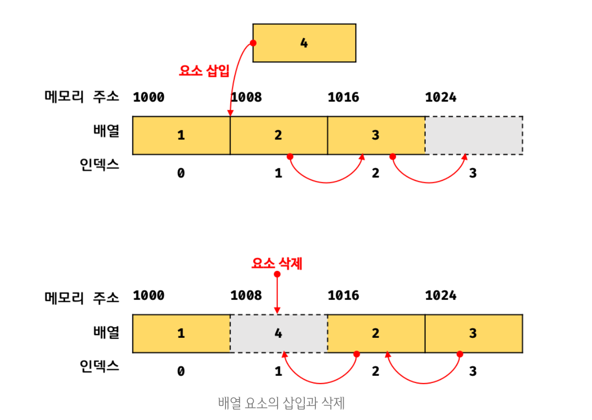

# 배열

> 배열은 프로그래밍 언어에서 지원하는 자료형 또는 컴퓨터공학에서 사용하는 자료구조의 하나이다.
> 순서대로 번호가 붙은 원소들이 연속적인 형태로 구성된 구조를 뜻하며, 이때 각 원소에 붙은 번호를 흔히 첨자(인덱스, index)라고 부른다.

## **자료구조에서의 배열**

🤔 자료구조에서 말하는 배열(array)은 동일한 크기의 메모리 공간이 빈틈없이 연속적으로 나열된 자료구조이다.

우리가 통상적으로 알고있는 이 배열을 밀집 배열(dense array)이라 한다.
→ 일반적인 배열은 각 요소가 동일한 데이터 크기를 가지며(하나의 타입으로 통일), 빈틈없이 연속적으로 이어져있다.


위와 같이 배열의 요소는 동일한 크기를 갖으며 빈틈없이 연속적으로 이어져 있으므로 아래와 같이 인덱스를 통해 단 한번의 연산으로 임의의 요소에 접근 할 수 있다. → 이는 매우 효율적이며 고속으로 동작한다.

<aside>
💡 검색 대상 요소의 메모리주소 = 배열의 시작 메모리주소 + 인덱스 * 요소의 바이트 수

</aside>

위의 그림 처럼 메모리 주소가 1000에서 시작하고 각 요소의 크기가 8byte인 배열을 생각해 보면

- 인덱스 0인 요소의 메모리 주소 : 1000 + 0 \* 8 = 1000
- 인덱스 1인 요소의 메모리 주소 : 1000 + 1 \* 8 = 1008
- 인덱스 2인 요소의 메모리 주소 : 1000 + 2 \* 8 = 1016

이처럼 배열은 인덱스를 통해 효율적으로 요소에 접근할 수 있다는 장점이 있다.

🤔 하지만 정렬되지 않은 배열에서 특정한 값을 탐색하는 경우, 모든 배열 요소를 처음부터 값을 발견할 때까지 차례대로 탐색(선형탐색(linearsearch), 시간 복잡도 O(n))해야 한다.

```jsx
// 선형 검색을 통해 주어진 배열(array)에 주어진 값(target)이 요소로 존재하는지 확인하여
// 존재하는 경우 해당 인덱스를 반환하고 존재하지 않는 경우 -1을 반환하는 함수

function linearSearch(array, target) {
  const length = array.length;

  for (let i = 0; i < length; i++) {
    if (array[i] === target) return i;
  }

  return -1;
}

console.log(linearSearch([1, 2, 3, 4, 5], 3)); // 2
console.log(linearSearch([1, 2, 3, 4, 5], 0)); // -1
```

🤔 또한 배열에 요소를 삽입하거나 삭제하는 경우, 배열 요소를 연속적으로 유지하기 위해 요소를 이동시켜야 하는 단점이 있다.



## **자바스크립트의 배열**

> **자바스크립트의 배열**은 일반적인 배열의 동작을 흉내 낸 특수한 객체이다.

😃 자바스크립트에서 배열은 요소를 위한 각각의 메모리 공간은 동일한 크기를 갖지 않아도 되며, 연속적으로 이어져 있지 않을 수도 있다. 👉 이렇게 배열의 요소가 연속적으로 이어져 있지 않는 배열을 희소 배열(sparse array)라고 한다.

```jsx
const arr = [1, 2, 3];

console.log(typeof arr); // object
console.log(arr.constructor === Array); // true
console.log(Object.getPrototypeOf(arr) === Array.prototype); // true
```

- 위 코드와 같이 자바스크립트에서의 배열은 객체이다.
- 그렇다면 일반 객체와는 어떠한 차이을 가질까 ?
  | 구분 | 객체 | 배열 |
  | --------------- | ------------------------- | ------------- |
  | 구조 | 프로퍼티 키와 프로퍼티 값 | 인덱스와 요소 |
  | 값의 참조 | 프로퍼티 키 | 인덱스 |
  | 값의 순서 | x | o |
  | length 프로퍼티 | x | o |

👉 일반 객체와 배열을 구분하는 가장 명확한 차이는 **값의 순서**와 **length 프로퍼티** 이다.

자바스크립트의 배열은 인덱스를 나타내는 문자열을 프로퍼티 key로 가지며, length 프로퍼티를 갖는 특수한 객체이다.

```jsx
console.log(Object.getOwnPropertyDescriptors([1, 2, 3]));

/*
{
  '0': { value: 1, writable: true, enumerable: true, configurable: true },
  '1': { value: 2, writable: true, enumerable: true, configurable: true },
  '2': { value: 3, writable: true, enumerable: true, configurable: true },
  length: { value: 3, writable: true, enumerable: false, configurable: false }
}
*/

// 자바스크립트 배열의 요소는 사실 value 값이다!
```

위의 코드와 같이 인덱스를 나타내는 문자열의 프로퍼티 key와 length 프로퍼티를 갖고 있다.

자바스크립트에서는 모든 값이 객체의 프로퍼티 값이 될 수 있으므로 어떠한 타입의 값이라도 배열의 요소가 될 수 있다.

- 일반적인 배열
  - 인덱스로 요소에 빠르게 접근이 가능하다.
  - 특정 요소를 겁색하거나 삽입 또는 삭제의 경우 효율적이지 않다.
- 자바스크립트의 배열
  - 해시 테이블로 구현된 객체이므로 인덱스로 요소에 접근하는 경우 일반적인 배열보다 성능적으로 느리다.
  - 특정 요소를 검색하거나 삽입 또는 삭제하는 경우에는 일반적인 배열보다 성능적으로 빠르다.

😃 즉, 자바스크립트 배열은 인덱스로 배열 요소에 접근하는 경우에는 일반적인 배열보다 느리지만 특정 요소를 탐색하거나 요소를 삽입 또는 삭제하는 경우에는 일반적인 배열보다 빠르다.

**자바스크립트 배열은 인덱스로 접근하는 경우의 성능 대신 특정 요소를 탐색하거나 배열 요소를 삽입 또는 삭제하는 경우의 성능을 선택한 것이다!**

이처럼 인덱스로 배열 요소에 접근할 때 일반적인 배열보다 느릴 수 밖에 없는 구조적인 단점을 보완하기 위해 대부분의 모던 자바스크립트 엔진은 배열을 일반 객체와 구별하여 보다 배열처럼 동작하도록 최적화하여 구현하였다.

```jsx
const arr = [];

console.time("Array Performance Test");

for (let i = 0; i < 10000000; i++) {
  arr[i] = i;
}
console.timeEnd("Array Performance Test");
// 약 340ms

const obj = {};

console.time("Object Performance Test");

for (let i = 0; i < 10000000; i++) {
  obj[i] = i;
}

console.timeEnd("Object Performance Test");
// 약 600ms
```

위와 같이 배열과 일반 객체의 성능을 테스트 해보면 배열이 일반 객체보다 약 2배 정도 빠른 것을 알 수 있다.

### > length 프로퍼티와 희소배열

- length 프로퍼티는 배열의 길이를 나타내는 0 이상의 정수를 값으로 갖는다.

```jsx
const arr = [1, 2, 3];
console.log(arr.length); // 3

arr.push(4);
console.log(arr.length); // 4
```

- length 프로퍼티에 임의의 값을 할당할 수도 있다.

```jsx
const arr = [1, 2, 3, 4, 5];

arr.length = 3;
console.log(arr); // [1, 2, 3]
```

```jsx
const arr = [1, 2];

arr.length = 4;

console.log(arr.length); // 4
console.log(arr); // [1, 2, <2 empty items> ]
```

위의 출력 결과에서 확인할 수 있는 `empty items` 는 실제로 추가 되지는 않는다.

현재 length 프로퍼티 값보다 큰 숫자를 할당하게 되면 length는 변경되지만 실제 배열에는 아무 변화가 없다.

```jsx
console.log(Object.getOwnPropertyDescriptors(arr));
/*
{
  '0': { value: 1, writable: true, enumerable: true, configurable: true },
  '1': { value: 2, writable: true, enumerable: true, configurable: true },
  length: { value: 4, writable: true, enumerable: false, configurable: false }
}
*/
```

위 코드를 보면 값이 없는 요소를 위해 메모리 공간을 확보하지 않는 것을 확인할 수 있다.

👉 이처럼 배열의 요소가 연속적으로 위치하지 않고 비어 있는 배열을 희소 배열 이라고 한다.
