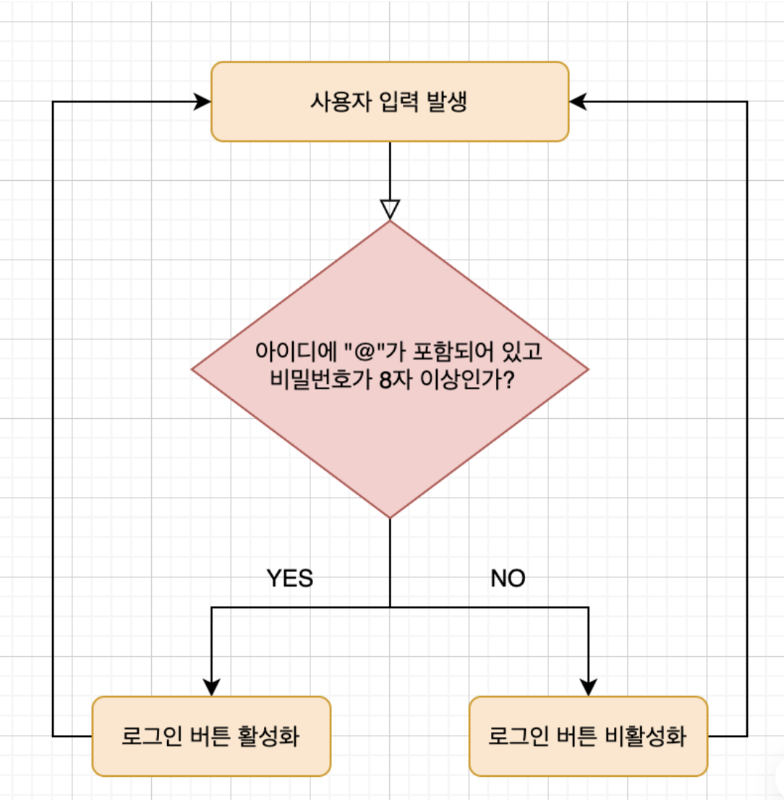

# 프로그래밍이란?

프로그래밍이란 컴퓨터에게 실행을 요구하는 일종의 **커뮤니케이션**이다.해결해야 할 문제(요구사항)를 명확히 이해한 후 적절한 문제 해결 방안을 정의할 필요가 있다.

👉 이때 요구되는 것이 **문제 해결 능력**이다.

> 문제 해결 능력을 함양하는 데 알고리즘 학습은 큰 도움이 되지만 문제 해결 능력은 더 큰 차원의 능력이다.

즉, 프로그래밍이란 0과 1밖에 알지 못하는 기계가 실행할 수 있을 정도로 정확하고 상세하게 요구를 설명하는 작업이며, 그 결과물이 바로 `코드`다.

## 컴퓨팅 사고(Computational thinking)

우리는 문제 해결 방안을 고려할 때 컴퓨터의 입장에서 문제를 바라봐야 한다.

컴퓨터와 사람은 사고, 인지의 방식이 다르다. 따라서 컴퓨터의 관점에서 문제를 사고해야 한다.

👉 여기에는 논리적, 수학적 사고가 필요하며, 해결 과제를 작은 단위로 분해하고 패턴화해서 추출하며, 프로그래밍 내에서 사용될 모든 개념은 평가 가능하도록 정의해야 한다.

**예시) 컴퓨터처럼 디자인하기 (Flow Chart)**


- 위 이미지를 보면 이메일과 비밀번호란이 비어 있어서 로그인 버튼이 비활성화 되어 있다.
- 사용자는 계속해서 멈추지 않고 이메일 혹은 비밀번호을 입력한다. (지울 수도 있다.)
- 사용자가 입력한 이메일과 비밀번호를 조건을 모두 만족할 때만 로그인 버튼이 활성화 된다.
  - 이메일 조건 : `@` 가 포함되어 있을 것
  - 비밀번호 조건 : 8자 이상일 것

👉 **Flow Chart**



- **확인사항**
  - 사용자의 입력이 발생 할 때 마다 조건이 실행되는가?
  - 최초 버튼이 활성화 되고 난 후에도 계속해서 입력에 따라서 활성, 비활성화가 변경되는가?

💡참고해서 보면 좋은 자료

1. [코딩 실력보다 컴퓨터 사고 능력이 더 중요하다](https://brunch.co.kr/@brunchjwshim/43#:~:text=%EC%BD%94%EB%94%A9%EC%9D%84%20%ED%95%98%EB%A0%A4%EB%A9%B4%20%EB%B0%98%EB%93%9C%EC%8B%9C%20%EC%95%8C%EC%95%84%EC%95%BC,%EB%AC%B8%EC%A0%9C%EB%93%A4%EA%B3%BC%20%EC%96%B4%EB%96%BB%EA%B2%8C%20%EC%97%B0%EA%B2%B0)
2. [배달의민족 CEO에게 뽑고 싶은 개발자를 물어보았다](https://www.youtube.com/watch?v=3H4umWD5bwI)

## 프로그래밍 언어

문제 해결 능력을 바탕으로 정의된 문제 해결 방안은 컴퓨터에게 전달되어야 한다.

→ 따라서 사람이 이해할 수 있는 자연어가 아닌 컴퓨터가 이해할 수 있는 기계어로 명령을 전달해야 한다.

🤔 But 사람이 기계어를 이해해서 기계어로 직접 명령을 전달하는 것은 매우 어렵다.

기계어로 직접 명령을 전달하는 것을 대신할 가장 유용한 대안은 사람이 이해할 수 있는 약속된 구문으로 구성된 프로그래밍 언어를 사용해 프로그램을 작성한 후, 그것을 컴퓨터가 이해할 수 있는 기계어로 변환하는 일종의 번역기를 이용하는 것이다.

👉 이 일종의 번역기를 **컴파일러** 혹은 **인터프리터** 라고 한다.

> compile : 변환하다
> interpret : 해석하다

## 구문과 의미

```jsx
const number = "string";
console.log(number * number); // NaN
```

위 예제는 문법적으로 전혀 문제가 없다.

But 의미적으로는 옳지 않다. number라는 이름의 변수에 문자열이 할당되어 있기 때문이다.

number라는 이름의 변수에는 숫자를 할당하는 것이 의미적으로 옳다.

💡 결국 문제 해결 능력을 통해 만들어낸 해결 방안은 프로그래밍 언어의 문법을 사용해 표현한다. 즉, 작성된 코드는 해결 방안의 구체적 구현물이다.
👉 이것은 프로그래밍 언어의 문법에 부합하는 것은 물론이고 수행하고자 하는 바를 정확히 수행하는 것, 즉 **요구사항이 실현(문제 해결)**되어야 의미가 있다.

프로그래밍 언어가 제공하는 문법을 적절히 사용하여 변수를 통해 값을 저장하고 참조하며 연산자로 값을 연산, 평가하고 조건문과 반복문에 의한 흐름제어로 코드의 실행 순서를 제어하고 함수로 재사용 가능한 문의 집합을 만들며 객체, 배열 등으로 자료를 구조화한다.

**결국 프로그래밍은 요구사항의 집합을 분석해서 적절한 자료구조와 함수의 집합으로 변환한 후, 그 흐름을 제어하는 것이다.**
