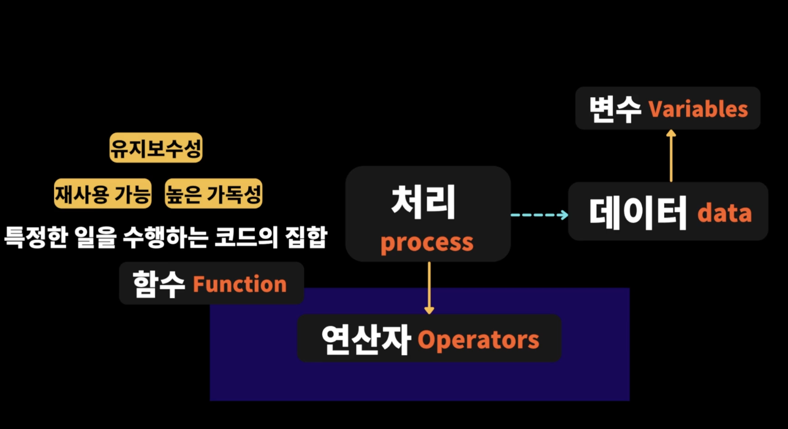
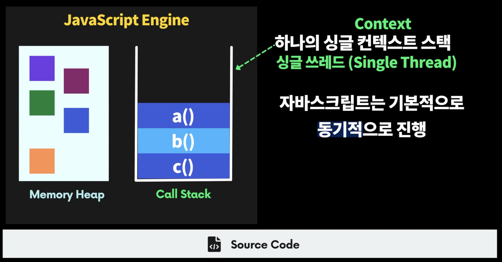

# 함수

### > 함수란?

함수를 잘 작성하는 것이 좋은 프로그래밍의 시작!

App(어플리케이션)에서 주된 일

**입력(input) → 처리(process) → 출력(output)**

여기서 처리(process) 해야 되는 데이터들을 임시로 보관해두는 곳이 바로 변수(variables)




- **함수는 특정한 일을 수행하는 코드의 집합**

함수는 특정한 블럭안에서 일들을 수행한다.

→ 입력(input) 값을 받아서 결과 값을 출력(Output) !

함수도 결국 객체이기 때문에 함수를 정의 하면 함수의 오브젝트가 Heap 이라는 메모리 공간에 할당이 되고

**함수의 이름은 함수를 참조하고 있다.** ( 함수 객체의 주소를 가지고 있다.)

**👦 함수와 메모리**

```jsx
function add(a, b) {
  return a + b;
}
const sum = add;

console.log(sum(1, 2)); // 3
console.log(add(1, 2)); // 3
```

- **함수 이름 자체는 함수를 가리키고 있는 변수와 동일하다.**
  → 함수의 이름을 어딘가에 할당 한다는 것은 함수를 가리키고 있는 메모리 주소를 복사해서 할당하는 것과 동일하다.

👦 **반환**

- return을 명시적으로 하지 않으면 자동으로 undefined가 반환된다.
- return을 일찍이 함수를 종료하는 용도로 사용할 수 있다.

```jsx
// 예시: 조건이 맞지 않는 경우 함수 도입부분에서 함수를 일찍이 종료함
function print(num) {
  if (num < 0) {
    return; // 함수 중간에 종료
  }
  console.log(num);
}
print(10);
pring(-10);
```

👦 **인자 (parameters)**

- 매개변수의 기본값은 무조건 undefined

```jsx
function add(a, b) {
  console.log(a); // undefined
  console.log(b); // undefined
  return a + b;
}
add();
```

- 매개변수의 정보는 함수 내부에서 접근이 가능한 arguments 객체에 저장됨
- 매개변수 기본값 Default Parameters

```jsx
function add(a = 1, b = 1) {
  return a + b;
}
add();
```

- Rest 매개변수 (Rest Parameters)

```jsx
function sum(a, b, ...numbers) {
  console.log(numbers);
  [3, 4, 5, 6];
}
sum(1, 2, 3, 4, 5, 6);
```

**👦 함수의 선언문과 표현식**

- 함수 선언문 function name () { }
- 함수 표현식 const name = function () { }

```jsx
let add = function (a, b) {
  return a + b;
};
add(1, 2); // 3
```

- 화살표 함수 const name = () ⇒ { }

```jsx
// 값만 리턴하는 함수라면 아래와 같이 작성할 수 있다. (return 생략)
const add = (a, b) => a + b;
```

- 생성자 함수 const object = new Function();

- IIFE ( 함수를 정의하면서 바로 호출하고 싶은 경우 )

```jsx
(function run() {
  console.log("hi");
})();
```

### > 콜백함수

💡 **일급객체** (일반 객체처럼 모든 연산이 가능한 것) / **일급함수** (함수가 일반 객체처럼 모든 연산이 가능한 것)

- 함수의 매개변수로 전달
- 함수의 반환값
- 할당 명령문
- 동일 비교 대상

💡 **고차함수**

- 인자로 함수를 받거나 (콜백함수)
- 함수를 반환하는 함수

💡 **콜백함수**

```jsx
// 함수의 꽃! 프로그래밍의 꽃!
const add = (a, b) => a + b;
const multiply = (a, b) => a * b;

// 전달된 action은 콜백함수이다.
// 전달될 당시에 함수를 바로 호출해서 반환된 값을 전달하는 것이 아니라
// 함수를 가리키고 있는 함수의 레퍼런스(참조값)가 전달된다.
// 그래서 함수는 고차함수안에서 필요한 순간에 호출이 나중에 됨
function calculator(a, b, action) {
  // a와 b인자를 받고, action이라는 함수를 전달 받는다
  if (a < 0 || b < 0) {
    return;
  }
  let result = action(a, b);
  console.log(result);
  return result;
}

calculator(1, 1, add);
calculator(1, 2, multiply);
```

```jsx
// 주어진 숫자 만큼 0부터 순회하는 함수
// 순회하면서 주어진 특정한 일을 수행해야 함
// 5, 순회하는 숫자를 다 출력하고 싶음
// 5, 순회하는 숫자의 두배값을 다 출력하고 싶음
// function iterate(max, action)
function iterate(max, action) {
  for (let i = 0; i < max; i++) {
    action(i);
  }
}

function log(num) {
  console.log(num);
}

function doubleAndLog(num) {
  console.log(num * 2);
}
iterate(3, (num) => console.log(num));
iterate(3, (num) => console.log(num * 2));

setTimeout(() => {
  console.log("3초뒤 이 함수가 실행될거예요");
}, 3000);
```

💡 **불변성(Immutability)** ⭐ ⭐

```jsx
// 코딩 할 때 중요한 컨셉!! -> Immutability (불변성)
// 모든 오브젝트를 변경 할 수 없게 만드는게 중요
// 함수내부에서 외부로부터 주어진 인자의 값을 변경하는 것은 좋지 않다!!
// 상태변경이 필요한 경우에는, 새로운 상태를(오브젝트, 값) 만들어서 반환해야 함 ✨
// 원시값 - 값에 의한 복사
// 객체값 - 참조에 의한 복사 (메모리주소가 전달된다.)
function display(num) {
  num = 5; // ❌ 함수 내부에서 num을 바꾸지마
  console.log(num);
}
const value = 4;
display(value);
console.log(value);

// ----------------------------------

function displayObj(obj) {
  obj.name = "Bob"; // ❌❌❌❌❌ 외부로 부터 주어진 인자(오브젝트)를 내부에서 변경 ❌
  console.log(obj);
}
const hyun = { name: "Hyun" };
displayObj(hyun);
console.log(hyun); // { name: "Bob" }

// ----------------------------------

function changeName(obj) {
  // 함수에서 내부를 변경 할 경우 함수 이름부터 변경하는 느낌을 주도록!!
  return { ...obj, name: "Bob" };
  // 반환 할때는 새로운 오브젝트 만들기!!
}
```
