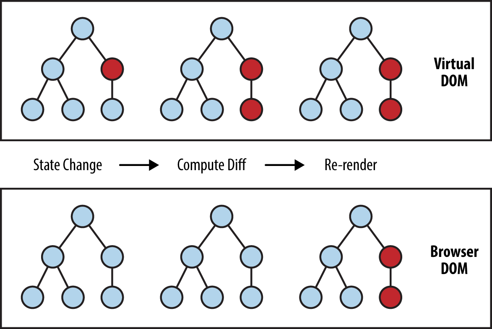

# virtual DOM에 대해서

> DOM(Document Object Model)은 XML이나 HTML 문서에 접근하기 위한 일종의 인터페이스다.
> DOM은 문서의 구조화된 표현(structured representation)을 제공하며 프로그래밍 언어가 DOM 구조에 접근할 수 있는 방법을 제공하여 그들이 문서 구조, 스타일, 내용 등을 변경할 수 있게 돕는다.

<aside>
💡 HTTP response > DOM tree > CSSOM tree > render tree > painting

</aside>
 

DOM은 새로운 요청이 있으면 위와 같은 형태를 거쳐 리렌더링을 하게 된다.
DOM의 속도는 느리지 않다. 하지만 매번 새롭게 구성하기 때문에, 양이 엄청 많으면 분명 퍼포먼스가 떨어질 것이다.
여기서 이제 Virtual DOM의 장점이 나오게 된다.

💡 React는 Virtual DOM을 사용하여 실제 DOM에 접근하여 조작하는 대신, 이를 추상화한 JavaScript 객체를구성하여 사용한다. 👉 마치 실제 DOM의 가벼운 사본과 비슷하다.

👉 HTML DOM의 추상화 버전

실제 DOM object와 같은 속성을 가지고 있지만, 실제 DOM이 갖고 있는 api는 가지고 있지 않다.
 

**👦 리액트에서 데이터가 변하여 웹 브라우저에 실제 DOM을 업데이트할 때는 다음과 같은 절차를 밟는다.**

1. 데이터가 변경되면 전체 UI는 virtual DOM에 렌더링된다.

2. 이전 virtual DOM에 있던 내용과 업데이트 후에 내용을 비교하여 **바뀐 부분**만 **실제 DOM에 적용시킨다.**
   즉, virtual DOM에 변경사항이 반영되면 원본 DOM에 필요한 변화만 반영되어서 전체의 real DOM을 바꾸지 않고도 필요한 UI의 업데이트를 적용할 수 있다.

- Virtual DOM은 html 객체에 기반한 자바스크립트 객체로 표현할 수 있다.
- Virtual DOM의 특징
  - 이러한 처리는 실제 DOM이 아닌 메모리상에서 동작하기 때문에 훨씬 더 빠르게 동작한다.
  - 또한 Vitrual DOM tree는 실제 렌더링이 되지 않기 때문에 연산비용이 적다.
  - 요소가 30개 바뀌었다고 레이아웃을 30개씩 새로 하는 것이 아니라 모든 변화를 하나로 묶어서 딱 한번만 실행.
  - 연산 횟수를 줄일 수 있기 때문에 실제 DOM 리렌더링에 비해 효율적이다.
- Virtual DOM의 역할
  - DOM fragment의 변화를 묶어서 적용한 다음 기존 DOM에 던져주는 과정
  - Virtual DOM은 이 과정을 자동화, 추상화해놓은 것에 불과
- React는 virtual DOM을 이용하는 대표적인 자바스크립트 라이브러리이다.

 

### Virtual DOM을 사용한다고 해서 사용하지 않을 때와 비교하여 무조건 빠른 것은 아니다.

결국 적절한 곳에 사용해야 리액트가 지닌 진가를 비로소 발휘할 수 있다.

리액트를 사용하지 않아도 코드 최적화를 열심히 하면 DOM 작업이 느려지는 문제를 개선할 수 있고,

작업이 매우 간단할 때는 오히려 리액트를 사용하지 않는 편이 더 나은 성능을 보이기도 한다.

🤔 리액트와 Virtual DOM이 언제나 제공할 수 있는 것은 바로 업데이트 처리 간결성이다.

👉 UI를 업데이트 하는 과정에서 생기는 복잡한 요소들을 모두 해소하고, 더욱 쉽게 업데이트에 접근 가능하다.
