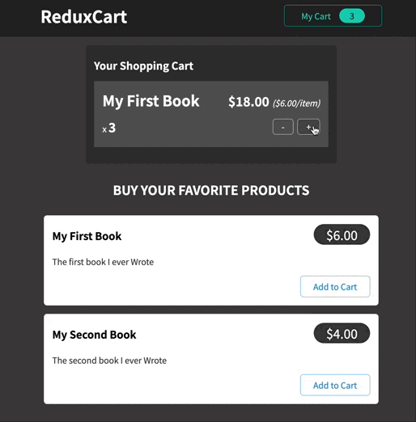
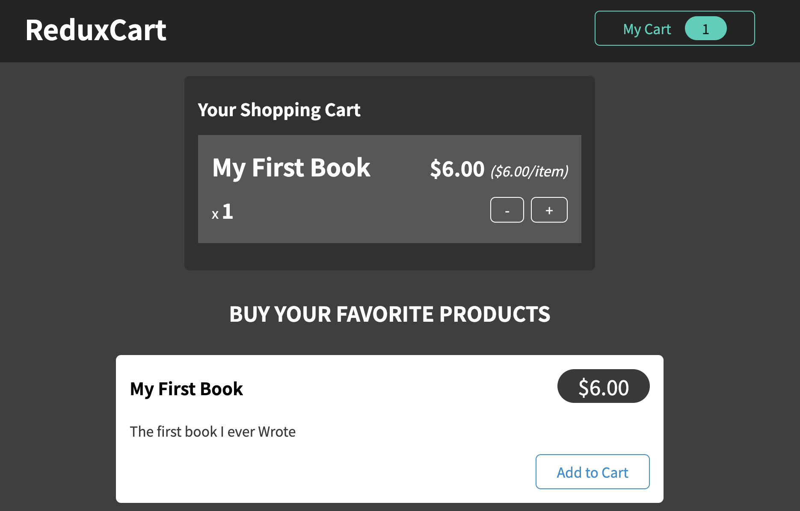
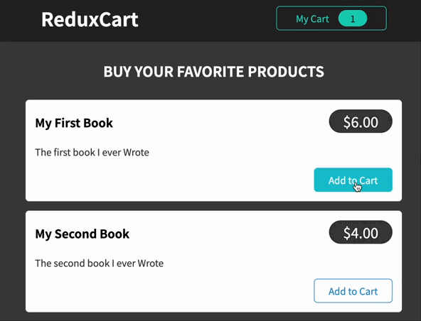

# 고급 리덕스1 (리덕스 툴킷)

```jsx
npm install @reduxjs/toolkit
```

```jsx
npm install react-redux
```

<br />

# 🐶 간단한 장바구니 토글 버튼 구현

1. 먼저 사용자 인터페이스 로직용(장바구니 토글링 같은 기능)으로
   개별적인 슬라이스를 만들어주자

```jsx
// src/store/ui-slice.js

import { createSlice } from "@reduxjs/toolkit";

const uiSlice = createSlice({
  name: "ui",
  initialState: { isCartVisible: false },
  reducers: {
    toggle(state) {
      state.isCartVisible = !state.isCartVisible;
    },
  },
});

export const uiActions = uiSlice.actions;

export default uiSlice;
```

- 슬라이스 함수를 만든다.
- 초기 상태는 `isCartVisible` 이며 프로퍼니는 `false`
- 그 다음 리듀서의 맵이라 할 수 있는 리듀서 키가 필요하다.
  - 여기서는 한 가지 메소드만 있으면 된다. (toggle 기능)
  - 리덕스 툴킷을 사용할 때, 상태를 실제로 변경하지 않기 때문에 state 변경 코드를 작성할 수 있지 👍
    ```jsx
    state.isCartVisible = !state.isCartVisible;
    ```
    리덕스 툴킷은 이 코드를 캡쳐하고 다른 제3의 라이브러리인 imer를 사용하여 이것이 실제로 기존 상태 개체를 조작하는 대신, 상태 개체를 생성하는 일부 변경 불가능한 코드로 변환되도록 한다.
- uislice.actions에 엑세스하여 얻은 uiaction을 내보내는 상수도 만들자

2. store/index.js 파일에 스토어 만들기

```jsx
// src/store/index.js

import { configureStore } from "@reduxjs/toolkit";

import uiSlice from "./ui-slice";

const store = configureStore({
  reducer: { ui: uiSlice.reducer },
});

export default store;
```

- configureStore를 불러 내고, 스토어를 구성한 다음 객체가 되면 루트 리듀서를 거기에 설정한다.
  → 그럼 이제 단일 리듀서 함수 또는 리듀서 맵이 될 수 있다.

3. 스토어 적용하기

```jsx
// index.js

import ReactDOM from "react-dom/client";
import { Provider } from "react-redux";

import "./index.css";
import App from "./App";
import store from "./store/index";

const root = ReactDOM.createRoot(document.getElementById("root"));
root.render(
  <Provider store={store}>
    <App />
  </Provider>
);
```

- 스토어를 내보낸 상태에서 적용을 위해서는 애플리케이션이 필요하다.
- 루트 컴포넌트를 설정하는 `index.js` 파일에서 이 작업을 수행
- 리액트 리덕스에서 프로바이더 컴포넌트를 가져와서 `<App />` 을 감싸준다.
- 물론 스토어도 가져와 전체 애플리케이션에 리덕스 스토어를 제공한다.

4. 토글 메소드 디스패치

```jsx
// src/components/cart/CartButton.js

import { useDispatch } from "react-redux";

import { uiActions } from "../../store/ui-slice";
import classes from "./CartButton.module.css";

const CartButton = (props) => {
  const dispatch = useDispatch();

  const toggleCartHandler = () => {
    dispatch(uiActions.toggle());
  };

  return (
    <button className={classes.button} onClick={toggleCartHandler}>
      <span>My Cart</span>
      <span className={classes.badge}>0</span>
    </button>
  );
};

export default CartButton;
```

- 리액트 리덕스에서 `useDispatch` 훅을 가져와 엑세스할 수 있다.
- uiActions의 토글을 메소드로 실행해야 한다.
- 이제 버튼을 클릭할 때마다 `toggleCartHandler` 를 트리거 해야한다.

5. useSeletor 훅 사용

```jsx
import { useSelector } from "react-redux";

import Cart from "./components/Cart/Cart";
import Layout from "./components/Layout/Layout";
import Products from "./components/Shop/Products";

function App() {
  const showCart = useSelector((state) => state.ui.isCartVisible);

  return (
    <Layout>
      {showCart && <Cart />}
      <Products />
    </Layout>
  );
}

export default App;
```

- `state.ui.cartVisible` 에 엑세스하여 프로퍼티 값 추출하고 `showCart`
  상수로 저장하기
- 이제 `<Cart />` 컴포넌트를 조건부로 표시하거나 숨길 수 있다

<br />

# 🐶 장바구니 관리



- 위의 상황에서 Add to Cart 버튼을 클릭하거나 / 더하기, 빼기 버튼을 클릭할 때 장바구니 항목이
  올바르게 업데이트 되어야 한다.
- 우측 상단의 My Cart의 카운트 숫자도 업데이트 되어야 한다.

<br />

## > 슬라이스 만들기

```jsx
// src/store/index.js

import { configureStore } from "@reduxjs/toolkit";

import uiSlice from "./ui-slice";
import cartSlice from "./cart-slice";

const store = configureStore({
  reducer: { ui: uiSlice.reducer, cart: cartSlice.reducer },
});

export default store;
```

```jsx
// src/store/cart-slice.js

import { createSlice } from "@reduxjs/toolkit";

const cartSlice = createSlice({
  name: "cart",
  initialState: {
    items: [], // 장바구니 품목
    totalQuantity: 0, // 장바구니 항목의 총 수량
  },
  reducers: {
    addItemToCart(){}
    removeItemFromCart(){}
  }
});

export const cartActions = cartSlice.actions;

export default cartSlice;
```

현재의 초기 상태는 어떠한가? 이 상태 슬라이스는 어떤 구조를 가져야 할까??

- 일종의 품목 → 장바구니 품목이 있어야 한다. (배열 상태)
- 장바구니 항목의 총 수량도 있어야 한다.

리듀서에는 위와 같이 아이템을 추가하거나, 제거하는 작업이 필요할 것이다.

그럼 `addItemToCart()` 함수는 어떤 역할을 해야 하는 것일까?

<br />

### addItemToCart()

```jsx
initialState: {
  items: [], // 장바구니 품목
  totalQuantity: 0, // 장바구니 항목의 총 수량
},

reducers: {
  addItemToCart(state, action){
     const newItem = action.payload;
     const existingItem = state.items.find(item => item.id === newItem.id);
     state.totalQuantity++;
     if (!existingItem){
       state.items.push({
          id: newItem.id,
          price: newItem.price,
          quantity: 1,
          totalPrice: newItem.price,
          name: newItem.title,
        });
     } else {
        existingItem.quantity++;
        existingItem.totalPrice = existingItem.totalPrice + newItem.price;
     }
  }
  removeItemFromCart(){}
}
```

- 아마 작업에서 항목을 추출해야 할 것이다.
  → 작업에 추가하는 데이터를 포함하는 리덕스 툴킷이 자동으로 설정하는 payload 프로퍼티가 된다.
- 이미 items 배열의 일부인지 확인을 하고 만약 그렇다면, 추가 품목으로 push 하는대신 기존 장바구니 품목의 수량을 늘린다.
- 만약 존재하지 않는 경우라면, 즉 `existingItem` 이 오류거나 아직 배열에 들어가지 않은 경우라면 추가를 해둬야 겠지
  → state.item으로 가서 새 항목을 push 한다.
  (💡push는 기존 상태의 기존 배열을 조작하기 때문에 리덕스만 사용할 경우엔 결과가 나쁠 것이다. 하지만, 리덕스 툴킷을 사용하면 내부적으로 기존 상태를 조작하지 않도록 보장하기 때문에 이런 문제가 발생하지 않는다, 대신 이것을 변경할 수 없는 방식으로 상태를 업데이트하는 작업으로 변환하는 것!)
- else의 경우에도 작업이 필요 (항목이 존재하는 경우)
  기존 항목의 수량을 1을 더한 값으로 설정
  총 가격에 `newItem.price` 를 더한 값과 동일하게 설정

<br />

### removeItemFromCart()

```jsx
initialState: {
  items: [], // 장바구니 품목
  totalQuantity: 0, // 장바구니 항목의 총 수량
},

reducers: {
  addItemToCart(state, action){
     const newItem = action.payload;
     const existingItem = state.items.find(item => item.id === newItem.id);
     state.totalQuantity++;
     if (!existingItem){
       state.items.push({
          id: newItem.id,
          price: newItem.price,
          quantity: 1,
          totalPrice: newItem.price,
          name: newItem.title,
        });
     } else {
        existingItem.quantity++;
        existingItem.totalPrice = existingItem.totalPrice + newItem.price;
     }
  }
  removeItemFromCart(state, action){
    const id = action.payload;
    const existingItem = state.items.find((item) => item.id === id);
    state.totalQuantity--;
    if (existingItem.quantity === 1) {
      state.items = state.items.filter((item) => item.id !== id);
    } else {
      existingItem.quantity--;
      existingItem.totalPrice = existingItem.totalPrice - existingItem.price;
    }
  }
}
```

- 여기서 `payload`는 item에 대한 id
- 이제 그 항목을 찾아 배열에서 제거해야 한다.
- `existingItem.quantity` 의 값이 1이라면 배열에서 항목을 완전히 제거한다.
  - `state.items = state.items.filter()` 로 설정한 다음 제거하려는 항목 하나를 필터링한다.
  - 제거하려는 state.items 항목이 누락될 새 배열로 항목 배열을 덮어쓰게 된다.
  - 다른 모든 항목을 유지하면서 배열에서 제거해야 하는 한 항목을 제거하기 위해 이러한 업데이트 방법을 쓴다.
- `existingItem.quantity` 의 값이 1이 아니라면 quantity와 totalPrice의 값을 마이너스 카운트 해준다.

<br />

## > 슬라이스 사용

```jsx
// src/components/Shop/Products.js
import ProductItem from "./ProductItem";
import classes from "./Products.module.css";

const DUMMY_PRODUCTS = [
  {
    id: "p1",
    price: 6,
    title: "My First Book",
    description: "The first book I ever Wrote",
  },
  {
    id: "p2",
    price: 4,
    title: "My Second Book",
    description: "The second book I ever Wrote",
  },
];

const Products = (props) => {
  return (
    <section className={classes.products}>
      <h2>Buy your favorite products</h2>
      <ul>
        {DUMMY_PRODUCTS.map((product) => (
          <ProductItem
            key={product.id}
            id={product.id}
            title={product.title}
            price={product.price}
            description={product.description}
          />
        ))}
      </ul>
    </section>
  );
};

export default Products;
```

- 우선 간단히 더미 데이터로 Shopping Cart 구성을 만들자

<br />

```jsx
// src/components/Shop/ProductItem.js
import { useDispatch } from "react-redux";

import { cartActions } from "../../store/cart-slice";
import Card from "../UI/Card";
import classes from "./ProductItem.module.css";

const ProductItem = (props) => {
  const dispatch = useDispatch();

  const { title, price, description, id } = props;

  const addToCartHandler = () => {
    dispatch(
      cartActions.addItemToCart({
        id,
        title,
        price,
      })
    );
  };

  return (
    <li className={classes.item}>
      <Card>
        <header>
          <h3>{title}</h3>
          <div className={classes.price}>${price.toFixed(2)}</div>
        </header>
        <p>{description}</p>
        <div className={classes.actions}>
          <button onClick={addToCartHandler}>Add to Cart</button>
        </div>
      </Card>
    </li>
  );
};

export default ProductItem;
```

- 위의 `<button />`을 `addItemToCart` 함수에 연결하자
- 이번 디스패치는 데이터도 전달해야 한다.
  장바구니에 항목을 추가할 때 제품 항목 내부에서 이 작업에 대한 페이로드로 객체를 전달 (id, title, price)

<br />

```jsx
// src/components/cart/CartButton.js

import { useDispatch, useSelector } from "react-redux";

import { uiActions } from "../../store/ui-slice";
import classes from "./CartButton.module.css";

const CartButton = (props) => {
  const dispatch = useDispatch();
  const cartQuantity = useSelector((state) => state.cart.totalQuantity);

  const toggleCartHandler = () => {
    dispatch(uiActions.toggle());
  };

  return (
    <button className={classes.button} onClick={toggleCartHandler}>
      <span>My Cart</span>
      <span className={classes.badge}>{cartQuantity}</span>
    </button>
  );
};

export default CartButton;
```

- `useSelector` 를 호출하고 `state.cart.totalQuantity` 를 가져와
- `cartQuantity` 라는 상수로 저장 후 뱃지에 로드~!
  

<br />

```jsx
import { useSelector } from "react-redux";

import Card from "../UI/Card";
import classes from "./Cart.module.css";
import CartItem from "./CartItem";

const Cart = (props) => {
  const cartItems = useSelector((state) => state.cart.items);

  return (
    <Card className={classes.cart}>
      <h2>Your Shopping Cart</h2>
      <ul>
        {cartItems.map((item) => (
          <CartItem
            key={item.id}
            item={{
              id: item.id,
              title: item.name,
              quantity: item.quantity,
              total: item.totalPrice,
              price: item.price,
            }}
          />
        ))}
      </ul>
    </Card>
  );
};

export default Cart;
```

<br />

```jsx
import { useDispatch } from "react-redux";

import { cartActions } from "../../store/cart-slice";
import classes from "./CartItem.module.css";

const CartItem = (props) => {
  const dispatch = useDispatch();

  const { title, quantity, total, price, id } = props.item;

  const removeItemHandler = () => {
    dispatch(cartActions.removeItemFromCart(id));
  };

  const addItemHandler = () => {
    dispatch(cartActions.addItemToCart({ id, title, price }));
  };

  return (
    <li className={classes.item}>
      <header>
        <h3>{title}</h3>
        <div className={classes.price}>
          ${total.toFixed(2)}{" "}
          <span className={classes.itemprice}>(${price.toFixed(2)}/item)</span>
        </div>
      </header>
      <div className={classes.details}>
        <div className={classes.quantity}>
          x <span>{quantity}</span>
        </div>
        <div className={classes.actions}>
          <button onClick={removeItemHandler}>-</button>
          <button onClick={addItemHandler}>+</button>
        </div>
      </div>
    </li>
  );
};

export default CartItem;
```

- 장바구니와 더하기 빼기 버튼도 구현!!


