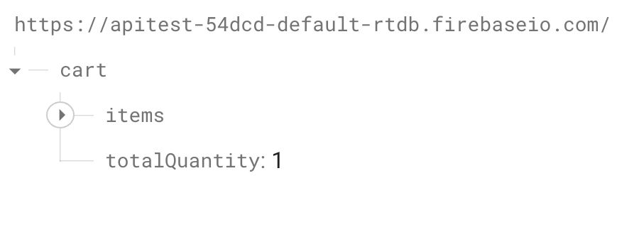
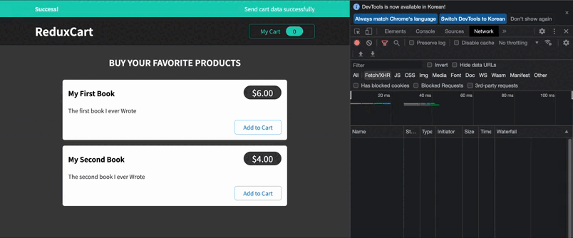
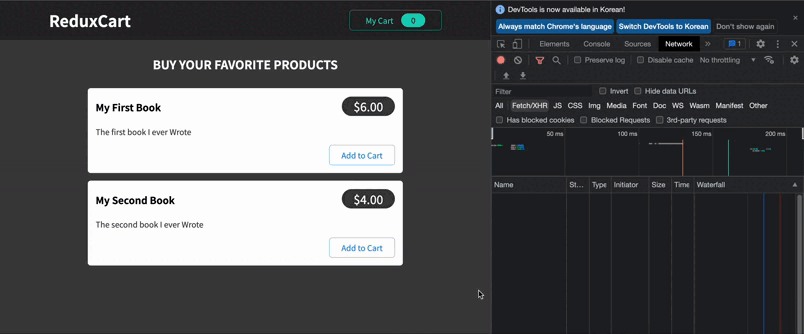

# 고급 리덕스2 (리덕스 썽크)

## 이제 리덕스를 sideEffect와 비동기 방식을 다루는 방법을 살펴보도록 하자!!

장바구니를 보낼 수 있는 서버인 백엔드 추가하기 (Firebase 사용)

항목을 추가하거나 수량을 줄이거나 항목을 제거하는 등 장바구니를 편집할 때마다
→ 백엔드 서버에 요청을 보내 업데이트 된 장바구니를 백엔드에 저장하여
→ 이것을 다시 로드할 때 프론트엔드에서 서버에 저장된 장바구니를 가져와 로드하고 표시하도록 !!

<br />

### http요청을 리덕스를 사용하는 반응 애플리케이션에 통합하려면 과연 어떻게 해야할까????

> 리듀서는 순수 함수여야 하고, side-effect가 없고 동기식(synchronous)여야 한다!
> 따라서 부작용을 생성하거나 http 요청을 보내는 것과 같이 비동기식인 코드가 있는 경우에는 리듀서 함수에 들어가서는 안된다.

<br />

### 그럼 side-effects 와 async tasks는 어디서 실행되어야 할까?

두가지 방법이 있다.

### 1. components 안에서

### 2. action creators 안에서

<br />

# 1. components 안에서

## 리덕스와 함께 useEffect()사용

기본적으로 `useSelector` 를 사용하고 장바구니 상태의 변경 사항을 수신하여 전체 장바구니를 파악할 수 있다.

→ 그럼 장바구니 상태가 변경될 때마다 http 요청을 보낼 수 있겠지!

```jsx
import { useSelector } from "react-redux";
import { useEffect } from "react";

import Cart from "./components/Cart/Cart";
import Layout from "./components/Layout/Layout";
import Products from "./components/Shop/Products";

function App() {
  const showCart = useSelector((state) => state.ui.isCartVisible);
  const cart = useSelector((state) => state.cart);

  useEffect(() => {
    fetch("https://apitest-54dcd-default-rtdb.firebaseio.com/cart.json", {
      method: "PUT",
      body: JSON.stringify(cart),
    });
  }, [cart]);

  return (
    <Layout>
      {showCart && <Cart />}
      <Products />
    </Layout>
  );
}

export default App;
```

- `useEFFect` 를 사용하여 장바구니 상태의 변경 사항을 관찰할 수 있다.
  - 종속성이 변경될 때마다 효과를 실행할 수 있다. (sideEffect)
- `.json`은 Firebase 전용이고 데이터베이스에 새 장바구니 노드가 생성되고 저장할 수 있다.
- “POST” 요청과 “PUT” 요청의 차이를 살펴보면 새 데이터가 데이터 목록에 추가되지 않고 기존의 데이터를 **오버라이드** 한다는 것!
  → 따라서 “PUT” 요청을 보낼 때 장바구니를 수신 데이터로 오버라이드
- `useSelector` 가 리덕스에 대한 구독을 설정한다는 점 때문에 리덕스 스토어가 변경될 때마다 `<App />` 컴포넌트가 다시 실행되고 최신 상태가 된다.
  (최신 버전의 장바구니)
  👉 장바구니가 변경되면 다시 실행되며 http 요청을 보내고 리덕스 상태에 따라 달라지는 sideEffect 를 수행할 수 있다.

<br />

### 💡 useEffect() 문제

> 위의 방식으로 useEffect()를 사용할 때 한 가지 문제가 있다.
> 바로 앱이 시작될 때 실행된다는 것
> 이것은 초기(즉, 비어있는) 카트를 백엔드로 보내고 거기에 저장된 모든 데이터를 덮어쓰기 때문에 문제가 된다!

<br />

## 리덕스로 Http State 및 피드백 처리하기

위의 코드에선 Http 요청을 보내고 있지만 응답에 대한 작업은 아무것도 하지 않고 있고 잠재적인 오류도 처리하지 않고 있다.

```jsx
import classes from "./Notification.module.css";

const Notification = (props) => {
  let specialClasses = "";

  if (props.status === "error") {
    specialClasses = classes.error;
  }
  if (props.status === "success") {
    specialClasses = classes.success;
  }

  const cssClasses = `${classes.notification} ${specialClasses}`;

  return (
    <section className={cssClasses}>
      <h2>{props.title}</h2>
      <p>{props.message}</p>
    </section>
  );
};

export default Notification;
```

- UI 폴더에 간단하게 알림 구성 요소인 컴포넌트를 추가해보자
- 상태 prop에 따라 다른 CSS를 가정하는 컴포넌트

→ 상단에 요청 보내기와 같은 내용을 설정하거나 완료 후에 성공과 오류 여부에 대해 알려주게끔 설정 가능하다.

<br />

`<Notification />` 컴포넌트를 사용하기 위해선 3개의 상태가 필요하다.

status, error, message

<br />

### 😄 `useState` 를 활용하여 에러 처리를 할 수도 있지만

만들어 둔 ui-slice가 있기 때문에 사용하지 않을 이유가 없다!

```jsx
import { createSlice } from "@reduxjs/toolkit";

const uiSlice = createSlice({
  name: "ui",
  initialState: { isCartVisible: false, notification: null },
  reducers: {
    toggle(state) {
      state.isCartVisible = !state.isCartVisible;
    },
    showNotification(state, action) {
      state.notification = {
        status: action.payload.status,
        title: action.payload.title,
        message: action.payload.message,
      };
    },
  },
});

export const uiActions = uiSlice.actions;

export default uiSlice;
```

- 초기 상태에 알림 프로퍼티를 초반에 `null` 로 설정하여 처음에는 알림을 받지 않도록 한다.
- `showNotification` 이라는 새로운 리듀서를 추가하자!
  - `action` 도 활용한다. → 일부 작업에 페이로드가 있을 것으로 예상되니깐
  - 알림 컴포넌트에 필요한 3가지 상태가 있으니 위와 같이 객체로 알림을 설정

<br />

### 😃 이제 데이터 작업이 완료되고 오류가 있는 경우 데이터 전송을

시작할 때 디스패치에 알림 작업이 표시되게 하자!!

```jsx
import { useSelector, useDispatch } from "react-redux";
import { useEffect } from "react";

import Cart from "./components/Cart/Cart";
import Layout from "./components/Layout/Layout";
import Products from "./components/Shop/Products";
import { uiActions } from "./store/ui-slice";
import Notification from "./components/UI/Notification";

function App() {
  const dispatch = useDispatch();
  const showCart = useSelector((state) => state.ui.isCartVisible);
  const cart = useSelector((state) => state.cart);
  const notification = useSelector((state) => state.ui.notification);

  useEffect(() => {
    const sendCartData = async () => {
      dispatch(
        uiActions.showNotification({
          status: "pending",
          title: "Sending...",
          message: "Sending cart data",
        })
      );
      const response = await fetch(
        "https://apitest-54dcd-default-rtdb.firebaseio.com/cart.json",
        {
          method: "PUT",
          body: JSON.stringify(cart),
        }
      );

      if (!response.ok) {
        throw new Error("Sending cart data failed.");
      }

      dispatch(
        uiActions.showNotification({
          status: "success",
          title: "Success!",
          message: "Send cart data successfully",
        })
      );
    };

    sendCartData().catch((error) => {
      dispatch(
        uiActions.showNotification({
          status: "error",
          title: "Error!",
          message: "Sending cart data failed",
        })
      );
    });
  }, [cart, dispatch]);

  return (
    <>
      {notification && (
        <Notification
          status={notification.status}
          title={notification.title}
          message={notification.message}
        />
      )}
      <Layout>
        {showCart && <Cart />}
        <Products />
      </Layout>
    </>
  );
}

export default App;
```

- 위의 코드와 같이 현재 상태에 따라 다른 notification 상태를 dispatch 한다.
  - **데이터 응답을 받기 전 상태**
  - **데이터를 성공적으로 받았을 때의 상태**
  - 이 코드의 다른 부분에서 오류가 있을 수도 있기 때문에 새로운 오류를 발생시키기 위해선 `sendCartData` 함수 아래로 이동하여 catch를 불러온다.
  - `sendCartData` 함수는 비동기 함수로 promise를 반환하므로 `catch` 를 불러올 수 있기 때문에 발생할 수 있는 모든 오류를 포착할 수 있다.
  - **이 함수 내부에서 발생할 수 있는 오류의 상태**
- notification의 초기상태가 null이 아닐 경우에 `<Notification />` 을 나타낸다.



<br />

### 🤔 그러나 장바구니를 처음부터 그대로 두고 싶진 않을 것이다.

→ 그러면 앱이 로드될 때 항상 백엔드의 기존 장바구니를 빈 장바구니로 오버라이드 하기 때문에

이 문제를 해결해보자!!

우선 `App.js` 에서 처음 실행할 때 장바구니를 보내지 않도록 해야한다.

```jsx
let isInitial = true;

function App(){
 ... // 일부코드생략
 useEffect(() => {
    const sendCartData = async () => {
      dispatch(
        uiActions.showNotification({
          status: "pending",
          title: "Sending...",
          message: "Sending cart data",
        })
      );
      const response = await fetch(
        "https://apitest-54dcd-default-rtdb.firebaseio.com/cart.json",
        {
          method: "PUT",
          body: JSON.stringify(cart),
        }
      );

      if (!response.ok) {
        throw new Error("Sending cart data failed.");
      }

      dispatch(
        uiActions.showNotification({
          status: "success",
          title: "Success!",
          message: "Send cart data successfully",
        })
      );
    };

    if (isInitial) {
      isInitial = false;
      return;
    }

    sendCartData().catch((error) => {
      dispatch(
        uiActions.showNotification({
          status: "error",
          title: "Error!",
          message: "Sending cart data failed",
        })
      );
    });
  }, [cart, dispatch]);
}
```

이것을 구현하기 위해서는 함수 외부에 변수를 추가할 수 있다.

isInitial로 지정하고 true로 설정 → 그리고 이것이 변경되지 않도록 컴포넌트 함수 외부에서 정의하도록 하자

컴포넌트가 다시 렌더링 되면 다시 초기화 하지 않는다.

대신 이 파일이 처음으로 parse 될 때 초기화 된다.

- 함수 내에서 isInitial 이라면 그냥 리턴 (데이터를 보내지 않는다.)
- isInitial을 false로 설정



**애플리케이션이 시작될 때만 차단되고 장바구니에 무언가를 추가하면
보류 상태와 성공상태가 차례로 표시된다!**

<br />

# 2. action creators 안에서

## 액션 생성자 Thunk 사용하기

지금 까지는 데이터를 fetch 하기 전에 모든 부작용 논리를 컴포넌트에 넣는 방법을 사용했다.

이것도 좋은 방법이지만 action creators를 사용하는 방법도 있다.

<br />

### 썽크(thunks)란 무엇이고 왜 필요한 것일까?

썽크는 다른 작업이 완료될 때까지 작업을 지연시키는 단순한 함수

action 객체를 즉시 반환하지 않는 action creators를 작성하기 위해

썽크로 action creators를 작성할 수 있다.

→ 대신에 결국 action을 반환하는 다른 함수를 반환하는 것

👉 그래서 만들고자 했던 실제 action object를 디스패치 하기 전에 다른 코드를 실행할 수있다.

<br />

`<App />` 컴포넌트에 있던 코드를 `cart-slice`로 옮겨보자 !!

```jsx
import { createSlice } from "@reduxjs/toolkit";

import { uiActions } from "./ui-slice";

const cartSlice = createSlice({
  name: "cart",
  // ... 이하 코드 생략
});

export const sendCartData = (cart) => {
  return async (dispatch) => {
    dispatch(
      uiActions.showNotification({
        status: "pending",
        title: "Sending...",
        message: "Sending cart data",
      })
    );

    const sendRequest = async () => {
      const response = await fetch(
        "https://apitest-54dcd-default-rtdb.firebaseio.com/cart.json",
        {
          method: "PUT",
          body: JSON.stringify(cart),
        }
      );

      if (!response.ok) {
        throw new Error("Sending cart data failed.");
      }
    };

    try {
      await sendRequest();
      dispatch(
        uiActions.showNotification({
          status: "success",
          title: "Success!",
          message: "Send cart data successfully",
        })
      );
    } catch (error) {
      dispatch(
        uiActions.showNotification({
          status: "error",
          title: "Error!",
          message: "Sending cart data failed",
        })
      );
    }
  };
};

export const cartActions = cartSlice.actions;

export default cartSlice;
```

- 슬라이스 객체 외부에서 새 함수를 생성한다.
- `sendCartData` 함수 내부에는 수행하려는 action을 디스패치 할 수 있다.

<br />

```jsx
import { useSelector, useDispatch } from "react-redux";
import { useEffect } from "react";

import Cart from "./components/Cart/Cart";
import Layout from "./components/Layout/Layout";
import Products from "./components/Shop/Products";
import { uiActions } from "./store/ui-slice";
import Notification from "./components/UI/Notification";
import { sendCartData } from "./store/cart-slice";

let isInitial = true;

function App() {
  const dispatch = useDispatch();
  const showCart = useSelector((state) => state.ui.isCartVisible);
  const cart = useSelector((state) => state.cart);
  const notification = useSelector((state) => state.ui.notification);

  useEffect(() => {
    if (isInitial) {
      isInitial = false;
      return;
    }
    dispatch(sendCartData(cart));
  }, [cart, dispatch]);

  return (
    <>
      {notification && (
        <Notification
          status={notification.status}
          title={notification.title}
          message={notification.message}
        />
      )}
      <Layout>
        {showCart && <Cart />}
        <Products />
      </Layout>
    </>
  );
}

export default App;
```

- useEffect에서 sendCartData를 전달하고 장바구니를 실행하고 인수로 전달한다.

👉 cartSlice에서 다른 함수를 반환하는 함수를 대신 전달한다.

리덕스 툴킷을 사용할 때 리덕스의 가장 큰 장점은 이에 대한 준비가 되어 있다는 것!

유형 프로퍼티가 있는 action 개체만 허용하는 것이 아니라 함수를 반환하는
action creators도 허용이 된다.

→ 그리고 실제로 action object가 아닌 함수인 action을 디스패치 하는 것으로 확인되면 해당 함수를 자동으로 실행한다.

```jsx
useEffect(() => {
  if (isInitial) {
    isInitial = false;
    return;
  }
  dispatch(sendCartData(cart));
}, [cart, dispatch]);
```

여기서 디스패치 할 때 리덕스가 계속 진행되고

슬라이스에 있는 `sendCartData` 함수가 실행하게 될 것이다.

따라서 다른 모든 작업이 디스패치 되고 http 요청도 전송될 것!

<aside>
💡 컴포넌트에 너무 많은 로직을 포함하지 않도록 action creator 함수로 옮김으로써 코드를 분할하여 컴포넌트를 린(lean) 상태로 유지할 수 있다.

</aside>

🤔 여기까지 잘 작동하지만 Firebase에서 장바구니를 가져온 게 아니기 때문에 장바구니는 빈 상태에서 시작된다.

<br />

# 데이터 가져오기

이제 애플리케이션이 로드될 때 장바구니를 가져오는 action creator를 빌드해보자!

지금까지는 데이터만 보내고 있지만 앱이 로드될 때 데이터를 fetch 하지 않았기 때문에 새로고침하면 여전히 손실되어 있을 것이다.

작업 크리에이터에서 진행하기 위해 cartSlice를 추가할 수 있지만 지금 파일이 점점 커지고 있기 때문에 `cart-action.js` 로 분리하여 진행해보자

```jsx
// store/cart-action.js

import { uiActions } from "./ui-slice";

export const fetchCartData = () => {
  return (dispatch) => {};
};

export const sendCartData = (cart) => {
  // ... 이하 생략
};
```

- fetchCartData 함수를 내보내고 있고 그 이전과 마찬가지로 즉시 인수로 전달된 함수를 반환한 다음 다른 작업을 수행한다.

<br />

```jsx
export const fetchCartData = () => {
  return (dispatch) => {
    const fetchData = async () => {
      fetch();
    };
  };
};
```

- fetchData 라는 새 함수를 만들고 비동기인 중첩 함수를 만든 다음
  fetch API를 사용하고 try catch 후 fetchData를 래핑 하고 싶기 때문
  → 그래서 별도에 함수에 넣는 것

<br />

```jsx
export const fetchCartData = () => {
  return async (dispatch) => {
    const fetchData = async () => {
      const response = await fetch(
        "https://apitest-54dcd-default-rtdb.firebaseio.com/cart.json"
      );

      if (!response.ok) {
        throw new Error("Could not fetch cart data");
      }

      const data = await response.json();

      return data;
    };

    try {
      const cartData = await fetchData();
    } catch (error) {
      dispatch(
        uiActions.showNotification({
          status: "error",
          title: "Error!",
          message: "Fetching cart data failed",
        })
      );
    }
  };
};
```

- 이번엔 get request!! ⇒ 기본값
- fetch 하는 장바구니 데이터는 Firebase에 저장되는 형식이다.
  → 물론 Firebase로 보내는 형식
- 아래의 cart로 보내야한다.
  ```jsx
  // App.js
  useEffect(() => {
    if (isInitial) {
      isInitial = false;
      return;
    }
    dispatch(sendCartData(cart));
  }, [cart, dispatch]);
  ```



<br />

장바구니는 위와 같이 항목 키가 있는 객체이며 내부에 배열과 총 수량 key가 있다.

리덕스 상태 스냅샷을 마지막 백엔드에 데이터로 보내기 때문에 이것은
프론트엔드 에서도 필요한 형식!!

`sendCartData` 에서는 put을 사용하여 데이터를 Firebase로 보내고
Firebase는 그대로 가져와서 변경하지 않고 `cart`에 있는 그대로 저장한다.

즉, fetch 할 때 구조도 수정해야 하므로 `cartData` 의 형식은 올바르게 지정될 것이다.

```jsx
// store/cart-slice.js
reducers: {
    replaceCart(state, action) {
      state.totalQuantity = action.payload.totalQuantity;
      state.items = action.payload.items;
    },
```

이제 이 리듀서를 사용하여 Firebase에서 로드하는 cart로 프론트엔드 cart를 교체할 수 있다.

<br />

```jsx
export const fetchCartData = () => {
  return async (dispatch) => {
    const fetchData = async () => {
      const response = await fetch(
        "https://apitest-54dcd-default-rtdb.firebaseio.com/cart.json"
      );

      if (!response.ok) {
        throw new Error("Could not fetch cart data");
      }

      const data = await response.json();

      return data;
    };

    try {
      const cartData = await fetchData();
      dispatch(cartActions.replaceCart(cartData));
    } catch (error) {
      dispatch(
        uiActions.showNotification({
          status: "error",
          title: "Error!",
          message: "Fetching cart data failed",
        })
      );
    }
  };
};
```

- `cartActions.replaceCart` 를 디스패치하고 cartData를 페이로드로 전달한다.

```jsx
// App.js
useEffect(() => {
  dispatch(fetchCartData());
}, [dispatch]);
```

- app.js 에서 디스패치한다.

<br />

### 💡 여기까지 해당 변경 사항을 데이터로 가져오지만 동시에 다시 보내고 있기도 함

```jsx
// App.js
useEffect(() => {
  dispatch(fetchCartData());
}, [dispatch]);

useEffect(() => {
  if (isInitial) {
    isInitial = false;
    return;
  }
  dispatch(sendCartData(cart));
}, [cart, dispatch]);
```

app.js에는 cart가 변경될 때마다 데이터를 보내기 위한 효과도 있기 때문에

문제는 `fetchCartData()` 가져올 때

```jsx
  try {
      const cartData = await fetchData();
      dispatch(cartActions.replaceCart(cartData));
    }
```

이렇게 가져온 데이터로 장바구니를 교체한다.

그래서 리덕스 내부의 장바구니가 달라지는 것

<br />

### 💡해결해보자

우선 `cart-slice` 로 이동하여 초기 상태에서 프로퍼티를 false로 바꾸어 설정

```jsx
import { createSlice } from "@reduxjs/toolkit";

const cartSlice = createSlice({
  name: "cart",
  initialState: {
    items: [],
    totalQuantity: 0,
    changed: false, // 초기 상태를 false로 지정
  },
  reducers: {
    replaceCart(state, action) {
      state.totalQuantity = action.payload.totalQuantity;
      state.items = action.payload.items;
    },
    addItemToCart(state, action) {
      const newItem = action.payload;
      const existingItem = state.items.find((item) => item.id === newItem.id);
      state.totalQuantity++;
      state.changed = true; // 초기상태 변경
      if (!existingItem) {
        state.items.push({
          id: newItem.id,
          price: newItem.price,
          quantity: 1,
          totalPrice: newItem.price,
          name: newItem.title,
        });
      } else {
        existingItem.quantity++;
        existingItem.totalPrice = existingItem.totalPrice + newItem.price;
      }
    },
    removeItemFromCart(state, action) {
      const id = action.payload;
      const existingItem = state.items.find((item) => item.id === id);
      state.totalQuantity--;
      state.changed = true; // 초기상태 변경
      if (existingItem.quantity === 1) {
        state.items = state.items.filter((item) => item.id !== id);
      } else {
        existingItem.quantity--;
        existingItem.totalPrice = existingItem.totalPrice - existingItem.price;
      }
    },
  },
});

export const cartActions = cartSlice.actions;

export default cartSlice;
```

- 장바구니를 교체한 경우에는 초기상태를 변경하지 않지만 장바구니에 항목을
  추가하거나 장바구니에서 제거하는 경우엔
  `state.changed` 를 `true` 로 변경한다.

<br />

```jsx
// App.js
useEffect(() => {
  if (isInitial) {
    isInitial = false;
    return;
  }

  if (cart.changed) {
    dispatch(sendCartData(cart));
  }
}, [cart, dispatch]);
```

- App.js 에서도 장바구니가 바뀌었는지 확인할 수 있다.
- `cart.changed` 가 true인 경우에만 cart 데이터를 디스패치하고 보낼 수 있다.

<br />

### 💡 장바구니를 완전히 비우고 새로고침하면 Firebase에는 더 이상 항목 키가 없기 대문에 오류가 발생한다.

```jsx
import { uiActions } from "./ui-slice";
import { cartActions } from "./cart-slice";

export const fetchCartData = () => {
  return async (dispatch) => {
    const fetchData = async () => {
      const response = await fetch(
        "https://apitest-54dcd-default-rtdb.firebaseio.com/cart.json"
      );

      if (!response.ok) {
        throw new Error("Could not fetch cart data");
      }

      const data = await response.json();

      return data;
    };

    try {
      const cartData = await fetchData();
      dispatch(
        cartActions.replaceCart({
          items: cartData.items || [],
          totalQuantity: cartData.totalQuantity,
        })
      );
    } catch (error) {
      dispatch(
        uiActions.showNotification({
          status: "error",
          title: "Error!",
          message: "Fetching cart data failed",
        })
      );
    }
  };
};
```

- `cart-actions` 로 이동하여 장바구니를 가져오는 곳을 확인!!
- `replacecart()` 에 전달하는 페이로드가 항상 `cartsData.items` 인 항목 키를 갖는 객체인지 또는 정의되지 않은, 즉 빈 배열인지를 확인해야 한다.
- 이를 통해 항목이 정의되지 않은 상태로 끝나지 않도록 한다.
  → 대신 항상 빈 배열
